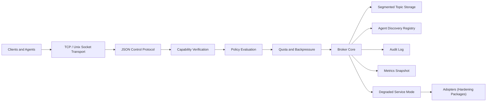

# Expressways

Expressways is a desktop-first, local-first coordination bus for multi-agent systems.

It is not trying to be a general-purpose cloud event platform in Phase 1. It is trying to be a broker you can run on a workstation, understand completely, operate confidently, and extend carefully without sacrificing auditability, access control, integrity, or availability.

The project is built around a simple idea:

> If agents are going to coordinate locally, the coordination layer should be as disciplined as the rest of the system.

That means every meaningful operation should be authenticated, authorized, quota-aware, auditable, observable, and recoverable. Expressways starts there and only adds complexity when the simpler system is already trustworthy.

The original long-range concept lives in [docs/main.md](docs/main.md). The implemented system is intentionally smaller, sharper, and more honest. The current scope is described in [docs/design/phase-1-system-design.md](docs/design/phase-1-system-design.md), [docs/design/security-compliance-baseline.md](docs/design/security-compliance-baseline.md), and [docs/adr/0001-phase-1-scope.md](docs/adr/0001-phase-1-scope.md).

## Table of Contents

- [Why Expressways Exists](#why-expressways-exists)
- [What Expressways Is](#what-expressways-is)
- [What Expressways Is Not](#what-expressways-is-not)
- [Design Principles](#design-principles)
- [System at a Glance](#system-at-a-glance)
- [Core Concepts](#core-concepts)
- [Request Lifecycle](#request-lifecycle)
- [Architecture](#architecture)
- [Resilience and Service Modes](#resilience-and-service-modes)
- [Adopters: Installable Hardening Packages](#adopters-installable-hardening-packages)
- [Workspace Layout](#workspace-layout)
- [Quick Start](#quick-start)
- [Guided Examples](#guided-examples)
- [Raw Protocol Examples](#raw-protocol-examples)
- [Configuration Guide](#configuration-guide)
- [Security, Integrity, and Availability Model](#security-integrity-and-availability-model)
- [Operational Model](#operational-model)
- [Benchmarks and Orchestration](#benchmarks-and-orchestration)
- [FAQ](#faq)
- [Roadmap](#roadmap)
- [Release Guardrails](#release-guardrails)

## Why Expressways Exists

Modern agent systems need a coordination layer, but most teams either:

- build ad-hoc local RPC chains,
- pile agents on top of raw files and sockets,
- or jump directly to infrastructure that is much larger than the actual local problem.

That usually creates one of two bad outcomes:

1. a fragile prototype that works until it matters, or
2. an overbuilt system whose complexity outruns the product.

Expressways takes a different path.

It assumes that a local agent bus should:

- be small enough to reason about,
- be strict enough to trust,
- be observable enough to operate,
- and be extensible enough to evolve without becoming a plugin-shaped attack surface.

That is why the project is:

- **single-node** in Phase 1,
- **control-plane-first** rather than throughput-first,
- **security-on-by-default** instead of security-later,
- **audit-heavy** rather than implicit,
- and **resilience-aware** rather than pretending nothing fails.

## What Expressways Is

Expressways is a Rust workspace for a local broker and its supporting tooling.

Today it includes:

- a broker daemon with local TCP transport and optional Unix sockets on Unix hosts,
- append-only segmented topic storage with sidecar indexes,
- signed capability-based identity and issuer/principal registries,
- policy checks and per-principal quota enforcement,
- a tamper-evident audit log,
- broker metrics and audit verification/export tooling,
- a file-backed discovery registry for agent cards,
- long-poll and streaming registry watch APIs,
- degraded-mode serving for subsystem failures,
- and installable hardening packages called **adopters**.

The current implementation is already useful as a durable local coordination layer, even though the long-range vision is larger.

## What Expressways Is Not

Expressways is not, in its current form:

- a multi-node cluster,
- a distributed consensus system,
- a Kafka replacement,
- a semantic/vector registry,
- an in-broker transform engine,
- a runtime plugin loader,
- or a promise that every failure mode has been eliminated forever.

The project deliberately chooses honest scope over impressive vocabulary.

## Design Principles

### 1. Correctness Before Optimization

The first release should explain itself. Fast paths are welcome later, but only after the behavior is explicit and measured.

### 2. Security and Auditability Are Runtime Contracts

Authentication, authorization, revocation, policy, and audit are not optional sidecars. They are part of the request path.

### 3. Local First

Expressways assumes the first useful deployment target is a developer workstation or a single host running multiple cooperating agents.

### 4. Degrade Instead of Disappearing

If a subsystem fails, the broker should try to remain servable with reduced capabilities where safe. The system should tell operators what degraded and why.

### 5. Extensibility Without Arbitrary Plugins

Extensibility is important, but arbitrary runtime code loading is an unacceptable trade when the broker is supposed to protect integrity and availability. Expressways extends through **build-installed, feature-gated adopter packages** plus a strict config allowlist.

### 6. Honest Interfaces

The documentation should match the code. The system should not claim clustering, semantic routing, or zero-copy transports unless those things actually exist.

## System at a Glance



If you only want the mental model, it is this:

- **Transport** gets the request to the broker.
- **Verification and policy** decide who is allowed to do what.
- **Quotas** decide whether the request is acceptable right now.
- **Broker logic** performs the action.
- **Storage and registry** hold durable state.
- **Audit and metrics** explain what happened.
- **Resilience and adopters** help the service stay available when dependencies misbehave.

## Core Concepts

### Broker

The broker is the authoritative control point for topic operations, registry operations, auth-state inspection, revocation changes, metrics access, and watch streams.

It is not a passive transport pipe. It enforces identity, policy, quotas, audit, and resilience behavior in one place.

### Topic

A topic is a named append-only log with default compliance metadata:

- `name`
- `retention_class`
- `default_classification`

Topics are created explicitly through the broker.

### Message

A stored message carries:

- `message_id`
- `topic`
- `offset`
- `timestamp`
- `producer`
- `classification`
- `payload`

Messages are ordered by append offset within a topic.

### Principal

A principal is the identity the broker recognizes after verifying a token. Principals are configured locally and carry:

- an `id`,
- a `kind`,
- allowed issuer keys,
- and a quota profile.

Principals are not caller-supplied strings that the broker blindly trusts.

### Capability Token

A capability token is a signed credential with:

- a `token_id`,
- `principal`,
- `audience`,
- `issued_at`,
- `expires_at`,
- and explicit resource/action scopes.

The broker verifies the signature, audience, expiry, issuer state, revocation state, and allowed principal linkage before proceeding.

### Policy

After capability verification, the broker performs a server-side policy check. Capability scope alone is not enough. Policy is the local source of truth for what the server permits.

The default policy is deny.

### Quota Profile

A quota profile controls how a principal can use publish and consume paths:

- maximum publish payload size,
- maximum consume batch size,
- request rate windows,
- and whether overload should `reject` or `delay`.

This makes rate and size behavior explicit rather than accidental.

### Classification

Expressways tracks message and registry sensitivity with a classification label:

- `public`
- `internal`
- `confidential`
- `restricted`

Classification is part of the model, not inferred from payload shape.

### Retention Class

Expressways tracks storage intent with a retention class:

- `ephemeral`
- `operational`
- `regulated`

Retention class informs local storage budgets and operational expectations.

### Audit Event

Every meaningful request path should produce tamper-evident audit records. Audit events are append-only and hash-chained so operators can verify integrity later.

An audit event includes:

- principal,
- action,
- resource,
- decision,
- outcome,
- optional detail,
- previous hash,
- and current hash.

### Discovery Registry

The discovery registry is a local, file-backed registry of agent cards. It supports:

- register,
- heartbeat,
- remove,
- cleanup stale entries,
- list with exact-match filters,
- long-poll watch,
- and multi-frame watch streaming with cursor resume.

It is intentionally exact-match and operational, not semantic or fuzzy.

### Agent Card

An agent card describes a service visible to other agents:

- `agent_id`
- `principal`
- `display_name`
- `version`
- `summary`
- `skills`
- `subscriptions`
- `publications`
- `schemas`
- `endpoint`
- `classification`
- `retention_class`
- `ttl_seconds`
- timestamps for freshness and expiry

Ownership comes from the authenticated principal, not from the request payload.

### Watch Stream

The registry supports both long-poll watch requests and a dedicated streaming watch transport.

The streaming version emits frames such as:

- `agent_watch_opened`
- `registry_events`
- `keep_alive`
- `stream_closed`
- `stream_error`

The stream has explicit timeout, idle-close, and slow-consumer protections.

### Service Mode

The broker exposes a service mode in health and metrics:

- `ok`
- `degraded`

If storage, audit, or an enabled adopter has trouble, the broker can stay alive and report degraded status rather than simply crashing or pretending everything is fine.

### Adopter

An adopter is a **hardening package** that probes or repairs a safety boundary.

Examples include:

- checking audit appendability and audit-chain integrity,
- validating storage directory writability,
- bootstrapping or validating registry persistence.

Adopters are **not** arbitrary runtime plugins. They are:

- separate crates,
- installed into the server build through Cargo features,
- and only activated if explicitly named in config.

This model preserves extensibility without allowing untrusted dynamic code loading.

## Request Lifecycle

Every request follows the same broad flow:

1. A client sends a `ControlRequest`.
2. The transport layer reads a single JSON line.
3. The broker decodes the request into a typed command.
4. Capability verification checks signature, audience, expiry, issuer status, revocations, and principal linkage.
5. Policy evaluates the verified principal against the requested resource and action.
6. Quota and backpressure checks run for publish and consume paths.
7. The broker executes the requested operation.
8. Structured logs are emitted.
9. Audit events are appended.
10. Metrics are updated.
11. The broker returns a typed response.

For streaming registry watches, the same controls are applied before the stream opens, then the connection transitions into frame-based delivery.

## Architecture

The current system is intentionally composed of small, direct components.

### Transport

Phase 1 uses:

- TCP by default,
- Unix sockets optionally on Unix hosts.

The transport is local and simple. The protocol is JSON over line framing.

### Protocol Layer

The protocol is defined in `expressways-protocol`. It contains:

- domain types,
- requests and responses,
- stream frames,
- metrics views,
- and resource naming helpers.

This keeps clients and the server aligned on the same control-plane schema.

### Authentication and Authorization

`expressways-auth` handles capability issuance and verification.  
`expressways-policy` handles server-side policy evaluation.

The broker requires both to pass before a request is allowed.

### Storage

`expressways-storage` implements append-only binary segments with index sidecars. It also enforces:

- per-retention-class budgets,
- global disk-pressure ceilings,
- and basic recovery behavior for stale indexes and truncated frames.

### Audit

`expressways-audit` records append-only, hash-chained audit events and provides offline verification/export utilities.

### Registry

The server owns a file-backed discovery registry with TTL-aware liveness behavior and bounded watch history.

### Metrics

The broker tracks request counts, failures, latency summaries, audit totals, storage maintenance stats, stream stats, resilience state, and adopter state.

### Resilience Runtime

The broker can:

- retry listener accepts,
- retry audit writes,
- start in degraded mode when configured dependencies are unavailable,
- keep serving some operations while reporting degraded state,
- and expose the exact degraded components in metrics.

### Adopters

Adopters sit beside the resilience runtime and focus on validating or repairing a particular boundary. They are installed as packages and enabled by id.

## Resilience and Service Modes

Expressways is designed to keep serving when it is safe to do so.

### Startup

If configured, the broker can start in degraded mode when:

- storage initialization fails,
- audit initialization fails,
- or enabled adopters report a failing condition.

That allows health, metrics, and diagnosis to remain available even if full publish/consume behavior is not.

### Runtime

During runtime, the broker can:

- retry audit writes with backoff,
- retry listener accept failures,
- continue serving requests while audit is degraded when configured to do so,
- and surface `service_degraded` errors for operations that cannot proceed safely.

### Health Semantics

`health` does not only mean “process is alive.”  
It reflects service mode:

- `ok`: all tracked critical components are healthy,
- `degraded`: the broker is running, but one or more tracked components are impaired.

### Why This Matters

A coordination layer that disappears during partial failure is often worse than one that stays up and tells the truth. Expressways tries to preserve that truthfulness.

## Adopters: Installable Hardening Packages

Adopters are the extensibility model for hardening logic.

### Why Adopters Exist

Different deployments care about different operational boundaries:

- audit durability,
- storage safety,
- registry validity,
- and future health checks that are specific to a workload or environment.

Those concerns should be extensible, but the extension model must not weaken the broker.

### Why They Are Not Runtime Plugins

Expressways does **not** support arbitrary runtime plugin loading. That is a deliberate safety choice.

Runtime plugin loading would make it much easier to compromise:

- integrity, by loading code the broker never reviewed,
- availability, by loading unstable or blocking extensions,
- and security, by allowing dynamic attack surface expansion.

Instead, adopters are:

- packaged as separate crates,
- compiled into the server binary through explicit Cargo features,
- and then enabled or disabled through config.

This gives you on-demand installation and separate packaging while keeping the trust boundary explicit.

### Available Adopters

#### `expressways-adopter-audit-integrity`

Checks:

- audit parent directory availability,
- audit appendability,
- audit-chain verification when enabled.

Can self-heal by creating the audit path when appropriate.

#### `expressways-adopter-storage-guard`

Checks:

- storage path existence,
- storage path type,
- storage writeability through a probe file.

Can self-heal by creating the storage directory when safe.

#### `expressways-adopter-registry-guard`

Checks:

- registry parent availability,
- registry document presence,
- basic structural validity of the registry JSON.

Can self-heal by bootstrapping the registry document when allowed.

### Installation Model

Default server builds include the built-in adopters.

To build a server with only selected adopters installed:

```bash
cargo run -p expressways-server --no-default-features --features adopter-audit-integrity,adopter-storage-guard -- --config configs/expressways.example.toml
```

Important:

- the Cargo features determine which adopter packages are **installed in the binary**,
- `adopters.enabled` in config determines which installed adopters are **active at runtime**,
- and `adopters.require_installed = true` forces startup to fail if config enables a package that the current server build does not contain.

That means if you build with a subset of adopter features, you should update `adopters.enabled` to match that subset.

## Workspace Layout

### Core crates

- `crates/expressways-protocol`: shared requests, responses, metrics views, stream frames, and domain types.
- `crates/expressways-auth`: capability issuance and verification, principal checks, issuer status, and revocation handling.
- `crates/expressways-policy`: server-side authorization policy evaluation.
- `crates/expressways-audit`: audit sink, hash chaining, verification, and export helpers.
- `crates/expressways-storage`: segmented storage, indexes, retention enforcement, disk-pressure controls, and recovery.
- `crates/expressways-server`: broker runtime, request handling, registry, resilience, adopters, and stream handling.
- `crates/expressways-client`: SDK, `expresswaysctl` CLI, and an `AgentWorker` helper for task-executing agents.

### Optional operational crates

- `crates/expressways-orchestrator`: task-driven supervisor and lifecycle tooling built on top of the broker.
- `crates/expressways-bench`: benchmark harness for transport, storage, and watch paths.

### Adopter crates

- `crates/expressways-adopter-api`: shared adopter interfaces and manifest types.
- `crates/expressways-adopter-audit-integrity`: audit path and audit-chain hardening package.
- `crates/expressways-adopter-storage-guard`: storage path hardening package.
- `crates/expressways-adopter-registry-guard`: registry persistence hardening package.

### Documentation

- `docs/design`: architecture and baseline operational contracts.
- `docs/adr`: scope and design decisions.
- `docs/plans`: execution planning.
- `docs/reviews`: critical review material.

## Quick Start

### 1. Read the design docs

Start with:

- [docs/design/phase-1-system-design.md](docs/design/phase-1-system-design.md)
- [docs/design/security-compliance-baseline.md](docs/design/security-compliance-baseline.md)
- [docs/adr/0001-phase-1-scope.md](docs/adr/0001-phase-1-scope.md)

### 2. Generate a development keypair

```bash
cargo run -p expressways-client --bin expresswaysctl -- generate-keypair --key-id dev --private-key ./var/auth/issuer.private --public-key ./var/auth/issuer.public
```

### 3. Issue a developer token

```bash
cargo run -p expressways-client --bin expresswaysctl -- issue-token --key-id dev --private-key ./var/auth/issuer.private --principal local:developer --audience expressways --scope system:broker:health --scope 'system:broker:admin' --scope 'topic:*:admin,publish,consume' --scope 'registry:agents*:admin' --output ./var/auth/developer.token
```

### 4. Start the broker

```bash
cargo run -p expressways-server -- --config configs/expressways.example.toml
make help
make run-expressways
```

The sample config enables:

- degraded startup,
- degraded runtime serving,
- audit retries,
- listener retries,
- and the built-in adopter allowlist.

### 5. Verify health

```bash
cargo run -p expressways-client --bin expresswaysctl -- --transport tcp --address 127.0.0.1:7766 health --token-file ./var/auth/developer.token
```

### 6. Create a topic, publish, and consume

```bash
cargo run -p expressways-client --bin expresswaysctl -- --transport tcp --address 127.0.0.1:7766 create-topic --token-file ./var/auth/developer.token --topic tasks
cargo run -p expressways-client --bin expresswaysctl -- --transport tcp --address 127.0.0.1:7766 publish --token-file ./var/auth/developer.token --topic tasks --payload "hello from scaffold"
cargo run -p expressways-client --bin expresswaysctl -- --transport tcp --address 127.0.0.1:7766 consume --token-file ./var/auth/developer.token --topic tasks --offset 0 --limit 10
```

## Guided Examples

### Example: Inspect service state

```bash
cargo run -p expressways-client --bin expresswaysctl -- --transport tcp --address 127.0.0.1:7766 health --token-file ./var/auth/developer.token
cargo run -p expressways-client --bin expresswaysctl -- --transport tcp --address 127.0.0.1:7766 metrics --token-file ./var/auth/developer.token
cargo run -p expressways-client --bin expresswaysctl -- --transport tcp --address 127.0.0.1:7766 adopters --token-file ./var/auth/developer.token
```

Use this when you want to know:

- whether the broker is `ok` or `degraded`,
- which components are degraded,
- what the request/audit/storage counters look like,
- and which adopter packages are installed, enabled, inactive, or failing.

### Example: Create a regulated topic with explicit defaults

```bash
cargo run -p expressways-client --bin expresswaysctl -- --transport tcp --address 127.0.0.1:7766 create-topic --token-file ./var/auth/developer.token --topic compliance-events --retention-class regulated --classification restricted
```

This is useful when you want the topic itself to declare the default compliance posture for later messages.

### Example: Publish a message with inherited classification

```bash
cargo run -p expressways-client --bin expresswaysctl -- --transport tcp --address 127.0.0.1:7766 publish --token-file ./var/auth/developer.token --topic compliance-events --payload '{"kind":"rotation_complete"}'
```

If classification is omitted, the broker uses the topic default.

### Example: Register and query an agent

```bash
cargo run -p expressways-client --bin expresswaysctl -- --transport tcp --address 127.0.0.1:7766 register-agent --token-file ./var/auth/developer.token --agent-id summarizer --display-name "Summarizer" --version 1.0.0 --summary "Local document summarizer" --skill summarize --skill pdf --subscribe topic:tasks --publish-topic topic:results --endpoint-address 127.0.0.1:8811 --ttl-seconds 300
cargo run -p expressways-client --bin expresswaysctl -- --transport tcp --address 127.0.0.1:7766 list-agents --token-file ./var/auth/developer.token --skill summarize
```

### Example: Keep an agent alive

```bash
cargo run -p expressways-client --bin expresswaysctl -- --transport tcp --address 127.0.0.1:7766 heartbeat-agent --token-file ./var/auth/developer.token --agent-id summarizer
```

### Example: Watch the registry with long-poll

```bash
cargo run -p expressways-client --bin expresswaysctl -- --transport tcp --address 127.0.0.1:7766 watch-agents --token-file ./var/auth/developer.token --wait-timeout-ms 30000 --follow
```

### Example: Watch the registry with a resumable stream

```bash
cargo run -p expressways-client --bin expresswaysctl -- --transport tcp --address 127.0.0.1:7766 watch-agents-stream --token-file ./var/auth/developer.token --wait-timeout-ms 30000 --resume true
```

This gives you:

- an opening frame,
- event frames,
- keepalives when idle,
- and cursor-based resume behavior after reconnect.

### Example: Inspect auth state and revoke a token

```bash
cargo run -p expressways-client --bin expresswaysctl -- --transport tcp --address 127.0.0.1:7766 auth-state --token-file ./var/auth/developer.token
cargo run -p expressways-client --bin expresswaysctl -- --transport tcp --address 127.0.0.1:7766 revoke-token --token-file ./var/auth/developer.token --token-id <token-id>
```

### Example: Verify the audit chain offline

```bash
cargo run -p expressways-client --bin expresswaysctl -- verify-audit --path ./var/audit/audit.jsonl
cargo run -p expressways-client --bin expresswaysctl -- export-audit --path ./var/audit/audit.jsonl --output ./var/audit/export.json
```

### Example: Run the orchestrator

```bash
cargo run -p expressways-orchestrator -- --transport tcp --address 127.0.0.1:7766 supervise --token-file ./var/auth/developer.token --state-path ./var/orchestrator/state.json --tasks-topic tasks --task-events-topic task_events
cargo run -p expressways-orchestrator -- --transport tcp --address 127.0.0.1:7766 serve-dashboard --token-file ./var/auth/developer.token --state-path ./var/orchestrator/state.json --listen 127.0.0.1:8787
make run-orchestrator
make run-dashboard
make run-stack
cargo run -p expressways-orchestrator -- show-metrics --state-path ./var/orchestrator/state.json
cargo run -p expressways-orchestrator -- list-tasks --state-path ./var/orchestrator/state.json --status assigned --sort-by priority --output table
cargo run -p expressways-orchestrator -- watch-tasks --state-path ./var/orchestrator/state.json --status assigned --sort-by priority --output table --refresh-interval-ms 1000
cargo run -p expressways-orchestrator -- show-task --state-path ./var/orchestrator/state.json --task-id task-1
cargo run -p expressways-orchestrator -- --transport tcp --address 127.0.0.1:7766 show-task-history --token-file ./var/auth/developer.token --task-id task-1 --status assigned --output table --limit 10
cargo run -p expressways-orchestrator -- --transport tcp --address 127.0.0.1:7766 tail-task-events --token-file ./var/auth/developer.token --status assigned --agent-id summarizer --output table --offset 0 --limit 5
cargo run -p expressways-orchestrator -- requeue-task --token-file ./var/auth/developer.token --state-path ./var/orchestrator/state.json --task-id task-1 --reason "operator requested reroute"
cargo run -p expressways-orchestrator -- cancel-task --token-file ./var/auth/developer.token --state-path ./var/orchestrator/state.json --task-id task-1 --reason "operator canceled obsolete work"
cargo run -p expressways-client --bin expresswaysctl -- --transport tcp --address 127.0.0.1:7766 submit-task --token-file ./var/auth/developer.token --task-id task-1 --task-type summarize_document --skill summarize --priority 50 --preferred-agent summarizer --avoid-agent fallback --payload-json '{"path":"notes.md"}'
cargo run -p expressways-client --bin expresswaysctl -- --transport tcp --address 127.0.0.1:7766 submit-task --token-file ./var/auth/developer.token --task-id task-pdf --task-type classify_document --skill classify --payload-file ./var/agent/incoming/report.pdf --payload-content-type application/pdf
cargo run -p expressways-client --bin expresswaysctl -- --transport tcp --address 127.0.0.1:7766 submit-task --token-file ./var/auth/developer.token --task-id task-image --task-type classify_image --skill vision --payload-file ./var/agent/incoming/image.png --payload-inline --payload-content-type image/png
cargo run -p expressways-client --bin expresswaysctl -- --transport tcp --address 127.0.0.1:7766 consume --token-file ./var/auth/developer.token --topic task_events --offset 0 --limit 20
cargo run -p expressways-client --bin expresswaysctl -- --transport tcp --address 127.0.0.1:7766 report-task --token-file ./var/auth/developer.token --task-id task-1 --assignment-id <assignment-id> --agent-id summarizer --status completed --attempt 1
```

This loop lets the supervisor consume `tasks`, emit audited `assigned` records to `task_events`, and then close the task when an agent reports `completed` or `failed`. The same topic also carries orchestrator-published `timed_out`, `retry_scheduled`, `exhausted`, and `canceled` lifecycle events. `show-metrics` summarizes the persisted orchestrator state with per-status counts, total retries, and oldest in-flight assignment age, while `list-tasks`, `watch-tasks`, and `show-task` let operators inspect which specific task is active, retrying, or stuck. `watch-tasks` is a live terminal view that refreshes the same filtered and sorted queue output used by `list-tasks`, so operators can monitor assignments without rerunning commands manually. `serve-dashboard` exposes the same queue and lifecycle data over a small local HTTP server with `/api/metrics`, `/api/tasks`, `/api/tasks/<task-id>`, and `/api/tasks/<task-id>/history`, plus a built-in browser dashboard on `http://127.0.0.1:8787/`. The queue and task detail views now also surface payload kind and content type, which makes binary tasks such as images, PDFs, and protobuf blobs inspectable alongside the original JSON task flow. If you want quick local entrypoints instead of pasting the full commands, `make help` lists the common workflows and `make run-expressways`, `make run-orchestrator`, `make run-dashboard`, and `make run-stack` wrap the same broker, supervisor, and dashboard flows. Both `list-tasks` and `show-task` now include the latest assignment rationale from the scheduler, and `list-tasks` can sort by `offset`, `priority`, `age`, or `retries` to make the queue more actionable. `show-task-history` and `tail-task-events` now share the same event filters for `task_id`, `status`, `agent_id`, and `assignment_id`, plus matching `json`, `jsonl`, and compact `table` outputs, so point-in-time inspection and live tailing use the same operator workflow. `submit-task` now accepts scheduler hints such as `--priority`, repeated `--preferred-agent`, and repeated `--avoid-agent`, plus generic payload forms with `--payload-json`, `--payload-text`, `--payload-base64`, or `--payload-file`. File payloads can be published as local file references or lifted into the task message with `--payload-inline`, which is how images, PDFs, protobuf bytes, and other binary assets are now carried safely over the existing JSON control protocol. Each orchestrator-generated `assigned` event now also includes a human-readable scheduler reason so operators can see why that agent won. `requeue-task` and `cancel-task` publish audited control events instead of mutating local state silently, and cancellation-aware workers can observe those events before they emit a stale completion.

### Example: Run the sample task agent

```bash
cargo run -p expressways-client --bin expressways-agent-example -- --transport tcp --address 127.0.0.1:7766 --token-file ./var/auth/developer.token --agent-id summarizer --display-name "Summarizer" --summary "Example document summarizer" --state-path ./var/agent/summarizer.state.json --output-dir ./var/agent/results
cargo run -p expressways-client --bin expresswaysctl -- --transport tcp --address 127.0.0.1:7766 submit-task --token-file ./var/auth/developer.token --task-id task-2 --task-type summarize_document --skill summarize --payload-json '{"path":"README.md","max_summary_lines":4}'
cargo run -p expressways-client --bin expresswaysctl -- --transport tcp --address 127.0.0.1:7766 consume --token-file ./var/auth/developer.token --topic task_events --offset 0 --limit 20
```

The sample agent uses `AgentWorker`, registers itself in the discovery registry, keeps a heartbeat running, and writes summary artifacts to `./var/agent/results/<task-id>.summary.json`. Its local checkpoint file lives at `./var/agent/summarizer.state.json`, so pending completion or failure reports are retried after restart. While a task is in flight it also watches `task_events` for `canceled`, `timed_out`, requeue, or superseding assignment events and stops cooperatively instead of writing a stale artifact.

### Example: Run the binary payload agent

```bash
cargo run -p expressways-client --bin expressways-agent-bytes-example -- --transport tcp --address 127.0.0.1:7766 --token-file ./var/auth/developer.token --agent-id blob-inspector --display-name "Blob Inspector" --summary "Example binary payload inspector" --state-path ./var/agent/blob-inspector.state.json --output-dir ./var/agent/blob-results
cargo run -p expressways-client --bin expresswaysctl -- --transport tcp --address 127.0.0.1:7766 submit-task --token-file ./var/auth/developer.token --task-id task-blob --task-type inspect_blob --skill binary --payload-file ./var/agent/incoming/report.pdf --payload-content-type application/pdf
cargo run -p expressways-client --bin expresswaysctl -- --transport tcp --address 127.0.0.1:7766 submit-task --token-file ./var/auth/developer.token --task-id task-inline-image --task-type inspect_blob --skill binary --payload-file ./var/agent/incoming/image.png --payload-inline --payload-content-type image/png
```

This example agent consumes `inspect_blob` tasks and uses the new `AssignedTask` payload helpers to inspect file references, inline bytes, or text payloads without custom base64 plumbing in the handler. It writes JSON artifacts to `./var/agent/blob-results/<task-id>.blob.json` with payload kind, content type, byte length, a short hex preview, UTF-8 preview when available, and file-ref metadata such as declared size or SHA-256.

### Example: Benchmark the broker

```bash
cargo run -p expressways-bench -- suite --spawn-server --broker-iterations 100 --warmup-iterations 20 --payload-bytes 512 --message-count 2000 --read-batch 250 --output ./var/benchmarks/latest.json
```

## Raw Protocol Examples

Expressways uses a simple JSON control protocol over line framing.

### Health request

```json
{
  "capability_token": "<signed-token>",
  "command": {
    "type": "health"
  }
}
```

### Health response

```json
{
  "type": "health",
  "node_name": "dev-node",
  "status": "ok"
}
```

If the broker is serving with reduced capabilities:

```json
{
  "type": "health",
  "node_name": "dev-node",
  "status": "degraded"
}
```

### Publish request

```json
{
  "capability_token": "<signed-token>",
  "command": {
    "type": "publish",
    "topic": "tasks",
    "classification": null,
    "payload": "hello from raw protocol"
  }
}
```

### Publish response

```json
{
  "type": "publish_accepted",
  "message_id": "00000000-0000-0000-0000-000000000000",
  "offset": 0,
  "classification": "internal"
}
```

### Degraded storage response

```json
{
  "type": "error",
  "code": "service_degraded",
  "message": "storage subsystem unavailable; broker is running in degraded mode"
}
```

### Adopters response

```json
{
  "type": "adopters",
  "adopters": [
    {
      "id": "storage_guard",
      "package": "expressways-adopter-storage-guard",
      "description": "Validates that the broker data directory exists, is a directory, and accepts write probes.",
      "enabled": true,
      "status": "healthy",
      "detail": "storage directory ./var/data passed write probe",
      "capabilities": ["health_probe", "self_heal"],
      "last_run_at": "2026-03-18T00:00:00Z"
    }
  ]
}
```

## Configuration Guide

Use [configs/expressways.example.toml](configs/expressways.example.toml) as the starting point.

### `[server]`

Controls:

- node identity,
- transport choice,
- listen address or socket path,
- broker data directory,
- log level.

### `[storage]`

Controls:

- segment size,
- default retention class,
- default classification,
- byte budgets for each retention class,
- global disk-pressure ceiling,
- reclaim target.

### `[audit]`

Controls:

- location of the append-only audit log.

### `[resilience]`

Controls:

- whether degraded startup is allowed,
- whether degraded runtime serving is allowed,
- audit retry count,
- audit retry backoff,
- listener retry delay.

### `[adopters]`

Controls:

- which installed adopter packages are enabled,
- how frequently they probe,
- whether startup must fail if config references an adopter not compiled into the current server binary,
- per-package settings under `[adopters.packages.<id>]`.

This is the important distinction:

- **installed** means “compiled into the server binary,”
- **enabled** means “turned on in config.”

### `[registry]`

Controls:

- registry backend,
- registry path,
- default TTL,
- watch history size,
- stream send timeout,
- idle keepalive limit.

### `[auth]`

Controls:

- audience,
- revocation file path,
- trusted issuers,
- principal definitions.

### `[quotas]`

Controls:

- named quota profiles,
- publish payload limits,
- consume batch limits,
- rate windows,
- reject vs delay backpressure behavior.

### `[policy]`

Controls:

- default decision,
- rules mapping principals to resources and actions.

## Security, Integrity, and Availability Model

### Identity

- Every request must carry a signed capability token.
- Principals and issuers are locally configured.
- Revocation is part of the runtime decision path.

### Authorization

- Capability scope is required.
- Policy evaluation is required.
- Default policy is deny.

### Quota and Backpressure

- Publish and consume are quota-aware.
- Rate-sensitive paths must explicitly reject or delay.

### Audit Integrity

- Allow and deny paths are audited.
- Audit is append-only and hash-chained.
- Audit can be verified offline.

### Service Availability

- The broker can stay alive in degraded mode.
- Health and metrics remain useful during partial failure.
- Listener and audit paths use retries.
- Storage-backed operations fail explicitly when storage is unavailable.

### Extensibility Safety

- No arbitrary runtime plugin loading.
- No unsigned external extension loading.
- Adopters must be compiled into the server build.
- Adopters must also be enabled in config.

## Operational Model

### Logs

Logs are structured JSON and are meant for operational analysis, not as a substitute for audit.

### Metrics

Metrics expose:

- request counters,
- publish/consume latency summaries,
- auth/policy/quota/storage/audit failures,
- stream lifecycle counters,
- resilience state,
- adopter state.

### Degraded Components

When degraded, metrics include component-level detail such as:

- `storage: ...`
- `audit: ...`
- `adopter:storage_guard: ...`

### Recovery

Recovery today is pragmatic and local:

- storage can recover indexes and trailing frames,
- audit can retry and re-open,
- adopters can probe and self-heal some paths,
- registry can bootstrap missing files when configured.

## Benchmarks and Orchestration

Expressways is not only a broker crate.

### Orchestrator

The orchestrator crate now demonstrates a task-driven local control loop built on top of the broker’s registry, topic storage, and audited publish/consume paths.

### Bench

The benchmark crate exists to keep the project honest. It measures:

- broker request paths,
- watch behavior,
- and storage throughput.

This makes future optimization work evidence-driven rather than speculative.

## FAQ

### Why not use Kafka?

Because the local coordination problem is smaller, more identity-sensitive, and more operationally intimate than a typical distributed streaming deployment. Expressways optimizes for local correctness and explainability first.

### Why not build clustering now?

Because clustering, consensus, distributed metadata, and local control-plane correctness are all separate risk buckets. Phase 1 deliberately solves the local broker honestly before expanding scope.

### Why not load adopters dynamically?

Because Expressways is responsible for security, integrity, and availability. Arbitrary runtime plugin loading would weaken all three. Feature-gated build installation plus config allowlisting is the safer extensibility model.

### Can the broker stay alive when dependencies fail?

Yes, when configured. Expressways supports degraded startup and degraded runtime serving where that behavior is safe and explicit.

### Does degraded mean safe?

Degraded means the broker is still running and reporting truthfully, not that every feature is still available. Some operations may return `service_degraded` while health, metrics, or other admin paths remain available.

## Roadmap

The next honest expansions are likely to be:

1. stronger storage indexing and batching,
2. more benchmark-driven transport improvements,
3. deeper orchestrator behaviors,
4. richer adopter packages,
5. better operator tooling,
6. eventually, carefully scoped distributed or replicated capabilities.

Notably absent from the immediate roadmap:

- fake clustering claims,
- runtime plugin loading,
- speculative complexity without measurement.

## Release Guardrails

No new externally reachable operation should ship unless it:

1. authenticates a principal,
2. verifies signed capability scope,
3. passes server-side policy,
4. emits audit events,
5. emits structured logs,
6. carries or inherits compliance metadata,
7. has explicit quota behavior when rate- or size-sensitive,
8. exposes enough metrics or verification surface for operators to explain what happened.

If any of those are missing, the change is incomplete.
