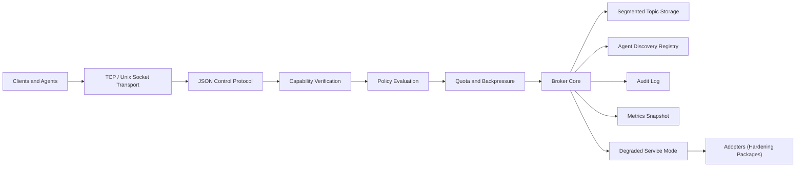

<p align="center">
  
</p>

# Expressways

[](https://github.com/Botfather/expressways/actions/workflows/ci.yml)
[](LICENSE)

> **Project status:** Alpha. Interfaces and persisted formats may change before `1.0`; there is currently no production support SLA.

Expressways is a desktop-first, local-first backbone for agents. It provides the durable, secure spine connecting LLM runtimes, chat applications, automation harnesses, device tools, and HTTP clients on macOS, Windows, and Linux.

It is not trying to be a general-purpose cloud event platform or a monolithic agent framework. It is a broker and control plane you can run on a workstation, understand completely, operate confidently, and connect to replaceable runtimes and adapters without sacrificing auditability, access control, integrity, or availability.

The project is built around a simple idea:

> If agents are going to coordinate locally, the coordination layer should be as disciplined as the rest of the system.

That means every meaningful operation should be authenticated, authorized, quota-aware, auditable, observable, and recoverable. Expressways starts there and only adds complexity when the simpler system is already trustworthy.

The product boundary and remaining gaps are described in [the local agent backbone design](docs/design/local-agent-backbone.md). The implemented scope is described in [the documentation index](docs/README.md), [the Phase 1 system design](docs/design/phase-1-system-design.md), [the security baseline](docs/design/security-compliance-baseline.md), and [the Phase 1 scope ADR](docs/adr/0001-phase-1-scope.md). A deliberately non-authoritative [original vision archive](docs/archive/original-vision.md) records ideas that are not implemented or promised.

## Table of Contents

- [Why Expressways Exists](#why-expressways-exists)
- [What Expressways Is](#what-expressways-is)
- [What Expressways Is Not](#what-expressways-is-not)
- [Design Principles](#design-principles)
- [System at a Glance](#system-at-a-glance)
- [Core Concepts](#core-concepts)
- [Request Lifecycle](#request-lifecycle)
- [Architecture](#architecture)
- [Resilience and Service Modes](#resilience-and-service-modes)
- [Adopters: Installable Hardening Packages](#adopters-installable-hardening-packages)
- [Workspace Layout](#workspace-layout)
- [Quick Start](#quick-start)
- [Guided Examples](#guided-examples)
- [Nanobot Parity Deployment](#nanobot-parity-deployment)
- [Interop Deployment](#interop-deployment)
- [Raw Protocol Examples](#raw-protocol-examples)
- [Configuration Guide](#configuration-guide)
- [Security, Integrity, and Availability Model](#security-integrity-and-availability-model)
- [Operational Model](#operational-model)
- [Benchmarks and Orchestration](#benchmarks-and-orchestration)
- [FAQ](#faq)
- [Roadmap](#roadmap)
- [Release Guardrails](#release-guardrails)
- [Contributing and Support](#contributing-and-support)

## Why Expressways Exists

Modern agent systems need a coordination layer, but most teams either:

- build ad-hoc local RPC chains,
- pile agents on top of raw files and sockets,
- or jump directly to infrastructure that is much larger than the actual local problem.

That usually creates one of two bad outcomes:

1. a fragile prototype that works until it matters, or
2. an overbuilt system whose complexity outruns the product.

Expressways takes a different path.

It assumes that a local agent bus should:

- be small enough to reason about,
- be strict enough to trust,
- be observable enough to operate,
- and be extensible enough to evolve without becoming a plugin-shaped attack surface.

That is why the project is:

- **single-node** in Phase 1,
- **control-plane-first** rather than throughput-first,
- **security-on-by-default** instead of security-later,
- **audit-heavy** rather than implicit,
- and **resilience-aware** rather than pretending nothing fails.

## What Expressways Is

Expressways is a Rust workspace for a local broker and its supporting tooling.

Today it includes:

- a broker daemon with local TCP transport and optional Unix sockets on Unix hosts,
- an authenticated loopback HTTP API for harnesses and local applications,
- append-only segmented topic storage with sidecar indexes,
- signed capability-based identity and issuer/principal registries,
- policy checks and per-principal quota enforcement,
- a tamper-evident audit log,
- broker metrics and audit verification/export tooling,
- a file-backed discovery registry for agent cards,
- long-poll and streaming registry watch APIs,
- degraded-mode serving for subsystem failures,
- and installable hardening packages called **adopters**.

The current implementation is already useful as a durable local coordination layer, even though the long-range vision is larger.

## What Expressways Is Not

Expressways is not, in its current form:

- a multi-node cluster,
- a distributed consensus system,
- a Kafka replacement,
- a semantic/vector registry,
- an in-broker transform engine,
- a runtime plugin loader,
- or a promise that every failure mode has been eliminated forever.

The project deliberately chooses honest scope over impressive vocabulary.

## Design Principles

### 1. Correctness Before Optimization

The first release should explain itself. Fast paths are welcome later, but only after the behavior is explicit and measured.

### 2. Security and Auditability Are Runtime Contracts

Authentication, authorization, revocation, policy, and audit are not optional sidecars. They are part of the request path.

### 3. Local First

Expressways assumes the first useful deployment target is a developer workstation or a single host running multiple cooperating agents.

### 4. Degrade Instead of Disappearing

If a subsystem fails, the broker should try to remain servable with reduced capabilities where safe. The system should tell operators what degraded and why.

### 5. Extensibility Without Arbitrary Plugins

Extensibility is important, but arbitrary runtime code loading is an unacceptable trade when the broker is supposed to protect integrity and availability. Expressways extends through **build-installed, feature-gated adopter packages** plus a strict config allowlist.

### 6. Honest Interfaces

The documentation should match the code. The system should not claim clustering, semantic routing, or zero-copy transports unless those things actually exist.

## System at a Glance


```mermaid
flowchart LR
    C["Clients and Agents"] --> T["TCP / Unix Socket Transport"]
    T --> P["JSON Control Protocol"]
    P --> V["Capability Verification"]
    V --> Y["Policy Evaluation"]
    Y --> Q["Quota and Backpressure"]
    Q --> B["Broker Core"]
    B --> S["Segmented Topic Storage"]
    B --> R["Agent Discovery Registry"]
    B --> A["Audit Log"]
    B --> M["Metrics Snapshot"]
    B --> D["Degraded Service Mode"]
    D --> H["Adopters (Hardening Packages)"]
```

If you only want the mental model, it is this:

- **Transport** gets the request to the broker.
- **Verification and policy** decide who is allowed to do what.
- **Quotas** decide whether the request is acceptable right now.
- **Broker logic** performs the action.
- **Storage and registry** hold durable state.
- **Audit and metrics** explain what happened.
- **Resilience and adopters** help the service stay available when dependencies misbehave.

## Core Concepts

### Broker

The broker is the authoritative control point for topic operations, registry operations, auth-state inspection, revocation changes, metrics access, and watch streams.

It is not a passive transport pipe. It enforces identity, policy, quotas, audit, and resilience behavior in one place.

### Topic

A topic is a named append-only log with default compliance metadata:

- `name`
- `retention_class`
- `default_classification`

Topics are created explicitly through the broker.

### Message

A stored message carries:

- `message_id`
- `topic`
- `offset`
- `timestamp`
- `producer`
- `classification`
- `payload`

Messages are ordered by append offset within a topic.

### Principal

A principal is the identity the broker recognizes after verifying a token. Principals are configured locally and carry:

- an `id`,
- a `kind`,
- allowed issuer keys,
- and a quota profile.

Principals are not caller-supplied strings that the broker blindly trusts.

### Capability Token

A capability token is a signed credential with:

- a `token_id`,
- `principal`,
- `audience`,
- `issued_at`,
- `expires_at`,
- and explicit resource/action scopes.

The broker verifies the signature, audience, expiry, issuer state, revocation state, and allowed principal linkage before proceeding.

All bundled CLIs, agents, orchestrators, Nanobot runtimes, and interop bridges use the same token loader. Token and bearer-secret files must be regular, non-symlinked UTF-8 files no larger than 64 KiB; on Unix they must not grant group or world access. Inline tokens are trimmed, non-empty, and subject to the same 64 KiB token bound.

### Policy

After capability verification, the broker performs a server-side policy check. Capability scope alone is not enough. Policy is the local source of truth for what the server permits.

The default policy is deny. Broker startup rejects a default-allow policy, empty or oversized
patterns, malformed wildcards, empty action lists, duplicate actions, and policy sets above the
safety bound. Rules may use an exact match, `*`, or one trailing `*` prefix wildcard.

### Quota Profile

A quota profile controls how a principal can use publish and consume paths:

- maximum publish payload size,
- maximum consume batch size,
- request rate windows,
- and whether overload should `reject` or `delay`.

This makes rate and size behavior explicit rather than accidental.

### Classification

Expressways tracks message and registry sensitivity with a classification label:

- `public`
- `internal`
- `confidential`
- `restricted`

Classification is part of the model, not inferred from payload shape.

### Retention Class

Expressways tracks storage intent with a retention class:

- `ephemeral`
- `operational`
- `regulated`

Retention class informs local storage budgets and operational expectations.

### Audit Event

Every meaningful request path should produce tamper-evident audit records. Audit events are append-only and hash-chained so operators can verify integrity later.

An audit event includes:

- principal,
- action,
- resource,
- decision,
- outcome,
- optional detail,
- previous hash,
- and current hash.

### Discovery Registry

The discovery registry is a local, file-backed registry of agent cards. It supports:

- register,
- heartbeat,
- remove,
- cleanup stale entries,
- list with exact-match filters,
- long-poll watch,
- and multi-frame watch streaming with cursor resume.

It is intentionally exact-match and operational, not semantic or fuzzy.
Consume and registry-watch cursors advance only through records actually returned or examined; pagination limits never move a cursor past matching records that were omitted from the current page.

### Agent Card

An agent card describes a service visible to other agents:

- `agent_id`
- `principal`
- `display_name`
- `version`
- `summary`
- `skills`
- `subscriptions`
- `publications`
- `schemas`
- `endpoint`
- `classification`
- `retention_class`
- `ttl_seconds`
- timestamps for freshness and expiry

Ownership comes from the authenticated principal, not from the request payload.

### Watch Stream

The registry supports both long-poll watch requests and a dedicated streaming watch transport.

The streaming version emits frames such as:

- `agent_watch_opened`
- `registry_events`
- `keep_alive`
- `stream_closed`
- `stream_error`

The stream has explicit timeout, idle-close, and slow-consumer protections.

### Service Mode

The broker exposes a service mode in health and metrics:

- `ok`
- `degraded`

If storage, audit, or an enabled adopter has trouble, the broker can stay alive and report degraded status rather than simply crashing or pretending everything is fine.

### Adopter

An adopter is a **hardening package** that probes or repairs a safety boundary.

Examples include:

- checking audit appendability and audit-chain integrity,
- validating storage directory writability,
- bootstrapping or validating registry persistence.

Adopters are **not** arbitrary runtime plugins. They are:

- separate crates,
- installed into the server build through Cargo features,
- and only activated if explicitly named in config.

This model preserves extensibility without allowing untrusted dynamic code loading.

## Request Lifecycle

Every request follows the same broad flow:

1. A client sends a `ControlRequest`.
2. The transport layer reads a single JSON line.
3. The broker decodes the request into a typed command.
4. Capability verification checks signature, audience, expiry, issuer status, revocations, and principal linkage.
5. Policy evaluates the verified principal against the requested resource and action.
6. Quota and backpressure checks run for publish and consume paths.
7. The broker executes the requested operation.
8. Structured logs are emitted.
9. Audit events are appended.
10. Metrics are updated.
11. The broker returns a typed response.

For streaming registry watches, the same controls are applied before the stream opens, then the connection transitions into frame-based delivery.

## Architecture

The current system is intentionally composed of small, direct components.

### Transport

Phase 1 uses:

- TCP by default,
- Unix sockets optionally on Unix hosts.

The transport is local and simple. The protocol uses bounded length-delimited frames. Unix socket
nodes are restricted to owner-only access (`0600`), and startup/shutdown cleanup refuses to remove
regular files or symlinks found at the configured socket path.

### Protocol Layer

The protocol is defined in `expressways-protocol`. It contains:

- domain types,
- requests and responses,
- stream frames,
- metrics views,
- and resource naming helpers.

This keeps clients and the server aligned on the same control-plane schema.

### Authentication and Authorization

`expressways-auth` handles capability issuance and verification.  
`expressways-policy` handles server-side policy evaluation.

The broker requires both to pass before a request is allowed.

### Storage

`expressways-storage` implements append-only binary segments with index sidecars. It also enforces:

- per-retention-class budgets,
- atomic global disk-pressure reservations across concurrent topics,
- rollback of partial segment/index writes,
- bounded topic-state and stored-frame reads,
- and streamed recovery for stale indexes and truncated or oversized frames.

The global byte counter and recovered topic state are initialized from disk and maintained in memory. Normal consumes therefore do not rescan complete segment contents, while the first access after restart still validates frames and reconstructs indexes using constant memory. Per-topic synchronization prevents recovery and reads from racing an active append.

On Unix, the storage root is owner-only (`0700`) and newly created segments, indexes, and state files are `0600`, preventing broker payloads from becoming readable through a permissive process umask.

### Audit

`expressways-audit` records append-only, hash-chained audit events and provides offline verification/export utilities.
Existing and newly created audit logs are restricted to `0600` on Unix; their containing directory is `0700`.

### Registry

The server owns a file-backed discovery registry with TTL-aware liveness behavior and bounded watch history.

### Metrics

The broker tracks request counts, failures, latency summaries, audit totals, storage maintenance stats, stream stats, resilience state, and adopter state.

### Resilience Runtime

The broker can:

- retry listener accepts,
- retry audit writes,
- start in degraded mode when configured dependencies are unavailable,
- keep serving some operations while reporting degraded state,
- and expose the exact degraded components in metrics.

### Adopters

Adopters sit beside the resilience runtime and focus on validating or repairing a particular boundary. They are installed as packages and enabled by id.

## Resilience and Service Modes

Expressways is designed to keep serving when it is safe to do so.

### Startup

If configured, the broker can start in degraded mode when:

- storage initialization fails,
- audit initialization fails,
- or enabled adopters report a failing condition.

That allows health, metrics, and diagnosis to remain available even if full publish/consume behavior is not.

### Runtime

During runtime, the broker can:

- retry audit writes with backoff,
- retry listener accept failures,
- continue serving requests while audit is degraded when configured to do so,
- and surface `service_degraded` errors for operations that cannot proceed safely.

### Health Semantics

`health` does not only mean “process is alive.”  
It reflects service mode:

- `ok`: all tracked critical components are healthy,
- `degraded`: the broker is running, but one or more tracked components are impaired.

### Why This Matters

A coordination layer that disappears during partial failure is often worse than one that stays up and tells the truth. Expressways tries to preserve that truthfulness.

## Adopters: Installable Hardening Packages

Adopters are the extensibility model for hardening logic.

### Why Adopters Exist

Different deployments care about different operational boundaries:

- audit durability,
- storage safety,
- registry validity,
- and future health checks that are specific to a workload or environment.

Those concerns should be extensible, but the extension model must not weaken the broker.

### Why They Are Not Runtime Plugins

Expressways does **not** support arbitrary runtime plugin loading. That is a deliberate safety choice.

Runtime plugin loading would make it much easier to compromise:

- integrity, by loading code the broker never reviewed,
- availability, by loading unstable or blocking extensions,
- and security, by allowing dynamic attack surface expansion.

Instead, adopters are:

- packaged as separate crates,
- compiled into the server binary through explicit Cargo features,
- and then enabled or disabled through config.

This gives you on-demand installation and separate packaging while keeping the trust boundary explicit.

### Available Adopters

#### `expressways-adopter-audit-integrity`

Checks:

- audit parent directory availability,
- audit appendability,
- audit-chain verification when enabled,
- and rejection of symlinked or non-regular audit targets.

Can self-heal by creating the audit path when appropriate.

#### `expressways-adopter-storage-guard`

Checks:

- storage path existence,
- storage path type,
- storage writeability through a collision-free `create_new` probe file.

Probe filenames are restricted to a single path component, and probes never truncate a pre-existing file or follow a configured traversal path.

Can self-heal by creating the storage directory when safe.

#### `expressways-adopter-registry-guard`

Checks:

- registry parent availability,
- registry document presence,
- bounded registry reads,
- exact schema-version and agent-count validation,
- and rejection of symlinked or non-regular registry targets.

Can self-heal by bootstrapping an owner-only registry document with an exclusive create when allowed.

### Installation Model

Default server builds include the built-in adopters.

To build a server with only selected adopters installed:

```bash
cargo run -p expressways-server --no-default-features --features adopter-audit-integrity,adopter-storage-guard -- --config configs/expressways.example.toml
```

Important:

- the Cargo features determine which adopter packages are **installed in the binary**,
- `adopters.enabled` in config determines which installed adopters are **active at runtime**,
- and `adopters.require_installed = true` forces startup to fail if config enables a package that the current server build does not contain.

That means if you build with a subset of adopter features, you should update `adopters.enabled` to match that subset.

## Workspace Layout

### Core crates

- `crates/expressways-protocol`: shared requests, responses, metrics views, stream frames, and domain types.
- `crates/expressways-auth`: capability issuance and verification, principal checks, issuer status, and revocation handling.
- `crates/expressways-policy`: server-side authorization policy evaluation.
- `crates/expressways-audit`: audit sink, hash chaining, verification, and export helpers.
- `crates/expressways-storage`: segmented storage, indexes, retention enforcement, disk-pressure controls, and recovery.
- `crates/expressways-server`: broker runtime, request handling, registry, resilience, adopters, and stream handling.
- `crates/expressways-client`: SDK, `expresswaysctl` CLI, and an `AgentWorker` helper for task-executing agents.
- `crates/expressways-adapter-sdk`: durable cursor, stable idempotency, and verified artifact helpers for channel and harness adapters.
- `crates/expressways-http-gateway`: supported loopback HTTP API that forwards caller capabilities to the broker.

### Optional operational crates

- `crates/expressways-orchestrator`: task-driven supervisor and lifecycle tooling built on top of the broker.
- `crates/expressways-bench`: benchmark harness for transport, storage, and watch paths.
- `expressways-interop-bridge`: supported, versioned two-way channel bridge with artifact upload, affinity routing, and durable reply delivery.
- `crates/expressways-nanobot-system`: Nanobot-style runtime kit with bootstrap, runtime loop, tool registry, session/memory persistence, cron, and outbound tailing.

### Adopter crates

- `crates/expressways-adopter-api`: shared adopter interfaces and manifest types.
- `crates/expressways-adopter-audit-integrity`: audit path and audit-chain hardening package.
- `crates/expressways-adopter-storage-guard`: storage path hardening package.
- `crates/expressways-adopter-registry-guard`: registry persistence hardening package.

### Documentation

- `docs/README.md`: documentation index and authority guidance.
- `docs/design`: architecture and baseline operational contracts.
- `docs/adr`: scope and design decisions.
- `docs/operations`: installation and operator runbooks.
- `docs/reviews`: critical review material.
- `docs/archive`: historical, non-authoritative context.

## Quick Start

### 1. Read the design docs

Start with:

- [docs/design/phase-1-system-design.md](docs/design/phase-1-system-design.md)
- [docs/design/http-gateway.md](docs/design/http-gateway.md)
- [docs/design/security-compliance-baseline.md](docs/design/security-compliance-baseline.md)
- [docs/design/openclaw-zeroclaw-interop.md](docs/design/openclaw-zeroclaw-interop.md)
- [docs/design/nanobot-parity-on-expressways.md](docs/design/nanobot-parity-on-expressways.md)
- [docs/adr/0001-phase-1-scope.md](docs/adr/0001-phase-1-scope.md)

### 2. Generate a development keypair

```bash
cargo run -p expressways-client --bin expresswaysctl -- generate-keypair --key-id dev --private-key ./var/auth/issuer.private --public-key ./var/auth/issuer.public
```

### 3. Issue a developer token

```bash
cargo run -p expressways-client --bin expresswaysctl -- issue-token --key-id dev --private-key ./var/auth/issuer.private --principal local:developer --audience expressways --scope system:broker:health --scope 'system:broker:admin' --scope 'topic:*:admin,publish,consume' --scope 'artifact:*:publish,consume,admin' --scope 'registry:agents*:admin' --output ./var/auth/developer.token
```

Or use the Makefile shortcut to generate an admin token:

```bash
make generate-admin-token
```

Packaged bundles can register the standard stack for automatic, least-privilege
per-user startup after credentials are generated:

```bash
scripts/install-user-service.sh install   # macOS LaunchAgent or Linux systemd user unit
```

```powershell
.\scripts\install-user-service.ps1 install  # Windows logon task
```

Both uninstallers stop the managed stack and preserve `var/` deliberately.
See [installation](docs/operations/installation.md) for status and removal
commands.

Bundle upgrades are checksum-gated transactions with authenticated health
validation and automatic rollback; they preserve runtime data and the active
operator config:

```bash
scripts/upgrade-bundle.sh verify /path/to/extracted-new-bundle
scripts/upgrade-bundle.sh apply /path/to/extracted-new-bundle
```

The desktop console also provides packaged first-run credential provisioning:
select the extracted bundle root and it creates owner-protected issuer material
and a 30-day local capability after validating the broker config. Existing
complete credentials are preserved, partial or symlinked locations fail
closed, and secret contents are never returned to the webview. A separate
explicit option renews the bounded-lifetime token without rotating issuer keys.

By default this uses `local:developer` (registered in `configs/expressways.example.toml`) and writes `./var/auth/admin.token`.
The target validates principal registration, status, policy-rule presence, and key compatibility before issuing the token.
You can override the principal when needed:

```bash
ADMIN_PRINCIPAL=local:developer make generate-admin-token
```

Or run one guarded bootstrap step:

```bash
make bootstrap-local
```

### 4. Start the broker

```bash
cargo run -p expressways-server -- --config configs/expressways.example.toml
make help
make run-expressways
```

The sample config enables:

- schema version metadata (`[schema].version = 1`) for upgrade diagnostics,
- degraded startup,
- degraded runtime serving,
- audit retries,
- listener retries,
- and the built-in adopter allowlist.

After the broker is running, verify first-run health/metrics/publish/consume in one command:

```bash
make verify-first-run
```

Run rehearsal automation with evidence capture:

```bash
make rehearse-clean-machine
make rehearse-rollback
make rehearse-config-rollback-reliability
make rehearse-reliability-denials
make rehearse-dr-restore-clean-env
make rehearse-key-rotation
make rehearse-m3-live-suite
make summarize-rollback-reliability-trend
make summarize-pilot-runs
```

### 5. Verify health

```bash
cargo run -p expressways-client --bin expresswaysctl -- --transport tcp --address 127.0.0.1:7766 health --token-file ./var/auth/developer.token
```

### 6. Create a topic, publish, and consume

```bash
cargo run -p expressways-client --bin expresswaysctl -- --transport tcp --address 127.0.0.1:7766 create-topic --token-file ./var/auth/developer.token --topic tasks
cargo run -p expressways-client --bin expresswaysctl -- --transport tcp --address 127.0.0.1:7766 publish --token-file ./var/auth/developer.token --topic tasks --payload "hello from scaffold"
cargo run -p expressways-client --bin expresswaysctl -- --transport tcp --address 127.0.0.1:7766 consume --token-file ./var/auth/developer.token --topic tasks --offset 0 --limit 10
```

## Guided Examples

### Example: Inspect service state

```bash
cargo run -p expressways-client --bin expresswaysctl -- --transport tcp --address 127.0.0.1:7766 health --token-file ./var/auth/developer.token
cargo run -p expressways-client --bin expresswaysctl -- --transport tcp --address 127.0.0.1:7766 metrics --token-file ./var/auth/developer.token
cargo run -p expressways-client --bin expresswaysctl -- --transport tcp --address 127.0.0.1:7766 adopters --token-file ./var/auth/developer.token
```

### Example: Export a support bundle

```bash
cargo run -p expressways-client --bin expresswaysctl -- --transport tcp --address 127.0.0.1:7766 export-support-bundle --token-file ./var/auth/admin.token --config configs/expressways.example.toml --audit-log ./var/audit/audit.jsonl --config-audit-log ./var/agent/config-audit/entries.jsonl --redact-sensitive true --redaction-profile standard --redact-placeholder "[REDACTED]" --logs-dir ./var/agent/service-control/logs --output ./var/agent/support-bundle.json
```

Use this when you want to know:

- whether the broker is `ok` or `degraded`,
- which components are degraded,
- what the request/audit/storage counters look like,
- and which adopter packages are installed, enabled, inactive, or failing.

Support bundle capture redacts sensitive lines by default and records redaction metadata (`enabled`, `profile`, `policy`, `placeholder`, `redacted_lines`) in the bundle payload. Use `--redaction-profile strict` when you need broader redaction coverage during incident sharing.

Validate support-bundle diagnostic coverage for the top 10 expected incident classes:

```bash
cargo run -p expressways-client --bin expresswaysctl -- validate-support-bundle --bundle ./var/agent/support-bundle.json --output ./var/agent/support-bundle-coverage.json
```

### Example: Backup and restore runtime state

```bash
cargo run -p expressways-client --bin expresswaysctl -- backup-runtime --config configs/expressways.example.toml --output-dir ./var/agent/backups --signing-private-key ./var/auth/issuer.private --signing-key-id dev
cargo run -p expressways-client --bin expresswaysctl -- restore-runtime --backup-dir ./var/agent/backups/expressways-backup-20260326T000000Z --verification-public-key ./var/auth/issuer.public --overwrite
```

The backup utility captures config plus broker/runtime state paths referenced by the config (data dir, auth revocations, issuer public keys, audit/registry files when present), and emits a manifest-driven bundle under `./var/agent/backups/`.
CLI file ingestion fails before allocation when configured limits are exceeded: configs are capped at 1 MiB, support bundles and signed backup manifests at 16 MiB, manifest signatures at 64 KiB, and inline task or artifact attachments at 64 MiB. These readers require regular files and do not follow symlinks.
Backup signs the exact manifest bytes with Ed25519. Restore requires an explicitly trusted verification key and authenticates that signature before parsing the manifest, then re-derives allowed destinations from the current trusted config (override it with `--config`), rejects unknown or retargeted entries, confines payload paths to the bundle's `payload/` directory, and verifies deterministic SHA-256 digests for every file and directory tree before replacing anything. Replacements are staged beside each destination and rolled back if installation fails; unsigned legacy manifests or manifests without content digests are intentionally rejected as unverifiable.
Runtime loaders migrate legacy persisted state documents in place to the current schema version (`1`) and fail fast on newer unsupported schema versions.

### Example: Create a regulated topic with explicit defaults

```bash
cargo run -p expressways-client --bin expresswaysctl -- --transport tcp --address 127.0.0.1:7766 create-topic --token-file ./var/auth/developer.token --topic compliance-events --retention-class regulated --classification restricted
```

This is useful when you want the topic itself to declare the default compliance posture for later messages.

### Example: Publish a message with inherited classification

```bash
cargo run -p expressways-client --bin expresswaysctl -- --transport tcp --address 127.0.0.1:7766 publish --token-file ./var/auth/developer.token --topic compliance-events --payload '{"kind":"rotation_complete"}'
```

If classification is omitted, the broker uses the topic default.

### Example: Register and query an agent

```bash
cargo run -p expressways-client --bin expresswaysctl -- --transport tcp --address 127.0.0.1:7766 register-agent --token-file ./var/auth/developer.token --agent-id summarizer --display-name "Summarizer" --version 1.0.0 --summary "Local document summarizer" --skill summarize --skill pdf --subscribe topic:tasks --publish-topic topic:results --endpoint-address 127.0.0.1:8811 --ttl-seconds 300
cargo run -p expressways-client --bin expresswaysctl -- --transport tcp --address 127.0.0.1:7766 list-agents --token-file ./var/auth/developer.token --skill summarize
```

### Example: Keep an agent alive

```bash
cargo run -p expressways-client --bin expresswaysctl -- --transport tcp --address 127.0.0.1:7766 heartbeat-agent --token-file ./var/auth/developer.token --agent-id summarizer
```

### Example: Watch the registry with long-poll

```bash
cargo run -p expressways-client --bin expresswaysctl -- --transport tcp --address 127.0.0.1:7766 watch-agents --token-file ./var/auth/developer.token --wait-timeout-ms 30000 --follow
```

### Example: Watch the registry with a resumable stream

```bash
cargo run -p expressways-client --bin expresswaysctl -- --transport tcp --address 127.0.0.1:7766 watch-agents-stream --token-file ./var/auth/developer.token --wait-timeout-ms 30000 --resume true
```

This gives you:

- an opening frame,
- event frames,
- keepalives when idle,
- and cursor-based resume behavior after reconnect.

### Example: Inspect auth state and revoke a token

```bash
cargo run -p expressways-client --bin expresswaysctl -- --transport tcp --address 127.0.0.1:7766 auth-state --token-file ./var/auth/developer.token
cargo run -p expressways-client --bin expresswaysctl -- --transport tcp --address 127.0.0.1:7766 revoke-token --token-file ./var/auth/developer.token --token-id <token-id>
```

### Example: Rotate issuer keys with overlap and cutover

Use this sequence for a safe issuer-key rotation:

1. Generate the new keypair:

```bash
cargo run -p expressways-client --bin expresswaysctl -- generate-keypair --key-id dev-2026q2 --private-key ./var/auth/dev-2026q2.private --public-key ./var/auth/dev-2026q2.public
```

2. Update `auth.issuers` and `auth.principals` in config for overlap:
   - keep old key `status = "active"`,
   - add new key `status = "rotating"`,
   - include both key ids in principal `allowed_key_ids`.

3. Restart broker and issue a token from the rotating key:

```bash
bash scripts/expressways-service.sh restart expressways-server
cargo run -p expressways-client --bin expresswaysctl -- issue-token --key-id dev-2026q2 --private-key ./var/auth/dev-2026q2.private --principal local:developer --audience expressways --scope system:broker:health --scope system:broker:admin --scope 'topic:*:admin,publish,consume' --scope 'registry:agents*:admin' --output ./var/auth/developer-rotating.token
```

4. Cut over config:
   - old key `status = "disabled"`,
   - new key `status = "active"`,
   - principal `allowed_key_ids` contains only the new key.

5. Restart broker and revoke retired key:

```bash
bash scripts/expressways-service.sh restart expressways-server
cargo run -p expressways-client --bin expresswaysctl -- --transport tcp --address 127.0.0.1:7766 revoke-key --token-file ./var/auth/developer-rotating.token --key-id dev
```

6. Verify state and rehearse end-to-end:

```bash
cargo run -p expressways-client --bin expresswaysctl -- --transport tcp --address 127.0.0.1:7766 auth-state --token-file ./var/auth/developer-rotating.token
make rehearse-key-rotation
```

### Example: Verify the audit chain offline

```bash
cargo run -p expressways-client --bin expresswaysctl -- verify-audit --path ./var/audit/audit.jsonl
cargo run -p expressways-client --bin expresswaysctl -- export-audit --path ./var/audit/audit.jsonl --output ./var/audit/export.json
```

Verification and export scan the hash chain as a bounded-record stream rather than loading the full log into memory. Export verifies each event in the same pass that writes it, stages the result with owner-only permissions, and replaces the destination only after the complete export is durable; the source audit log cannot be selected as the destination.

### Example: Run the orchestrator

```bash
cargo run -p expressways-orchestrator -- --transport tcp --address 127.0.0.1:7766 supervise --token-file ./var/auth/developer.token --state-path ./var/orchestrator/state.json --tasks-topic tasks --task-events-topic task_events
cargo run -p expressways-orchestrator -- --transport tcp --address 127.0.0.1:7766 serve-dashboard --token-file ./var/auth/developer.token --state-path ./var/orchestrator/state.json --listen 127.0.0.1:8787
make run-orchestrator
make run-dashboard
make run-stack
cargo run -p expressways-orchestrator -- show-metrics --state-path ./var/orchestrator/state.json
cargo run -p expressways-orchestrator -- list-tasks --state-path ./var/orchestrator/state.json --status assigned --sort-by priority --output table
cargo run -p expressways-orchestrator -- watch-tasks --state-path ./var/orchestrator/state.json --status assigned --sort-by priority --output table --refresh-interval-ms 1000
cargo run -p expressways-orchestrator -- show-task --state-path ./var/orchestrator/state.json --task-id task-1
cargo run -p expressways-orchestrator -- --transport tcp --address 127.0.0.1:7766 show-task-history --token-file ./var/auth/developer.token --task-id task-1 --status assigned --output table --limit 10
cargo run -p expressways-orchestrator -- --transport tcp --address 127.0.0.1:7766 tail-task-events --token-file ./var/auth/developer.token --status assigned --agent-id summarizer --output table --offset 0 --limit 5
cargo run -p expressways-orchestrator -- requeue-task --token-file ./var/auth/developer.token --state-path ./var/orchestrator/state.json --task-id task-1 --reason "operator requested reroute"
cargo run -p expressways-orchestrator -- cancel-task --token-file ./var/auth/developer.token --state-path ./var/orchestrator/state.json --task-id task-1 --reason "operator canceled obsolete work"
cargo run -p expressways-client --bin expresswaysctl -- --transport tcp --address 127.0.0.1:7766 submit-task --token-file ./var/auth/developer.token --task-id task-1 --task-type summarize_document --skill summarize --priority 50 --preferred-agent summarizer --avoid-agent fallback --payload-json '{"path":"notes.md"}'
cargo run -p expressways-client --bin expresswaysctl -- --transport tcp --address 127.0.0.1:7766 submit-task --token-file ./var/auth/developer.token --task-id task-pdf --task-type classify_document --skill classify --payload-file ./var/agent/incoming/report.pdf --payload-content-type application/pdf
cargo run -p expressways-client --bin expresswaysctl -- --transport tcp --address 127.0.0.1:7766 submit-task --token-file ./var/auth/developer.token --task-id task-image --task-type classify_image --skill vision --payload-file ./var/agent/incoming/image.png --payload-inline --payload-content-type image/png
cargo run -p expressways-client --bin expresswaysctl -- --transport tcp --address 127.0.0.1:7766 put-artifact --token-file ./var/auth/developer.token --artifact-id report-1 --file ./var/agent/incoming/report.pdf --content-type application/pdf --classification restricted --retention-class regulated
cargo run -p expressways-client --bin expresswaysctl -- --transport tcp --address 127.0.0.1:7766 stat-artifact --token-file ./var/auth/developer.token --artifact-id report-1
cargo run -p expressways-client --bin expresswaysctl -- --transport tcp --address 127.0.0.1:7766 get-artifact --token-file ./var/auth/developer.token --artifact-id report-1 --output-file ./tmp/report-copy.pdf
cargo run -p expressways-client --bin expresswaysctl -- --transport tcp --address 127.0.0.1:7766 consume --token-file ./var/auth/developer.token --topic task_events --offset 0 --limit 20
cargo run -p expressways-client --bin expresswaysctl -- --transport tcp --address 127.0.0.1:7766 report-task --token-file ./var/auth/developer.token --task-id task-1 --assignment-id <assignment-id> --agent-id summarizer --status completed --attempt 1
```

The dashboard permits unauthenticated access only on a loopback bind. A non-loopback listener requires `--access-bearer` or, preferably, `--access-bearer-file`; every client or terminating reverse proxy request must send `Authorization: Bearer <value>`. Request headers are capped at 8 KiB, reads time out after 5 seconds, and concurrent connections default to 64 (`--request-timeout-ms` and `--max-connections` adjust these limits). For the Make targets, pass the authentication option through `DASHBOARD_ACCESS_ARGS`, for example `DASHBOARD_ACCESS_ARGS='--access-bearer-file ./var/auth/dashboard.token'`.

This loop lets the supervisor consume `tasks`, emit audited `assigned` records to `task_events`, and then close the task when an agent reports `completed` or `failed`. The same topic also carries orchestrator-published `timed_out`, `retry_scheduled`, `exhausted`, and `canceled` lifecycle events. `show-metrics` summarizes the persisted orchestrator state with per-status counts, total retries, and oldest in-flight assignment age, while `list-tasks`, `watch-tasks`, and `show-task` let operators inspect which specific task is active, retrying, or stuck. `watch-tasks` is a live terminal view that refreshes the same filtered and sorted queue output used by `list-tasks`, so operators can monitor assignments without rerunning commands manually. `serve-dashboard` exposes the same queue and lifecycle data over a small local HTTP server with `/api/metrics`, `/api/tasks`, `/api/tasks/<task-id>`, and `/api/tasks/<task-id>/history`, plus a built-in browser dashboard on `http://127.0.0.1:8787/`. The queue and task detail views now also surface payload kind and content type, which makes binary tasks such as images, PDFs, and protobuf blobs inspectable alongside the original JSON task flow. If you want quick local entrypoints instead of pasting the full commands, `make help` lists the common workflows and `make run-expressways`, `make run-orchestrator`, `make run-dashboard`, and `make run-stack` wrap the same broker, supervisor, and dashboard flows. Both `list-tasks` and `show-task` now include the latest assignment rationale from the scheduler, and `list-tasks` can sort by `offset`, `priority`, `age`, or `retries` to make the queue more actionable. `show-task-history` and `tail-task-events` now share the same event filters for `task_id`, `status`, `agent_id`, and `assignment_id`, plus matching `json`, `jsonl`, and compact `table` outputs, so point-in-time inspection and live tailing use the same operator workflow. `submit-task` now accepts scheduler hints such as `--priority`, repeated `--preferred-agent`, and repeated `--avoid-agent`, plus generic payload forms with `--payload-json`, `--payload-text`, `--payload-base64`, or `--payload-file`. File payloads are uploaded to the broker as managed artifacts by default, so task messages carry `artifact_ref` metadata instead of host-local paths; `--payload-inline` is still available when you want images, PDFs, protobuf bytes, or other blobs up to the 64 MiB attachment ceiling embedded directly in the task message. Workers fetch managed artifacts through the authenticated broker API and verify the returned length and SHA-256 before handlers can read them. Broker-local paths and task-supplied `file_ref` paths are treated as untrusted metadata and are never opened implicitly by `AssignedTask`; remote artifact responses omit broker-local paths entirely. The broker also exposes `put-artifact`, `stat-artifact`, and `get-artifact` for explicit artifact workflows, including hash verification and durable local storage under the broker data directory. Artifact directories are `0700` and blobs/metadata are durably written as `0600` on Unix. Each orchestrator-generated `assigned` event now also includes a human-readable scheduler reason so operators can see why that agent won. `requeue-task` and `cancel-task` publish audited control events instead of mutating local state silently, and cancellation-aware workers can observe those events before they emit a stale completion.

Orchestrator state is size-bounded and semantically validated before use, including collection limits and map-key/record-ID consistency. Incoming task work items are rejected before mutation when their serialized form exceeds 1 MiB or when identifiers, agent-hint collections, retry counts, or durations violate safety bounds; oversized raw task messages are discarded before JSON parsing. Lifecycle events are limited to 64 KiB and their identifiers, reasons, task offsets, attempts, and active-lease identity are validated before any state mutation. Saves use an atomically renamed, durably flushed owner-only file (`0600` on Unix), so an interrupted write cannot expose a partially serialized live state document.

Managed artifacts are capped at 64 MiB and metadata at 64 KiB. Reads are bounded before allocation, and truncated, growing, oversized, or directory-escaping symlink files fail closed.

### Example: Run the sample task agent

```bash
cargo run -p expressways-client --bin expressways-agent-example -- --transport tcp --address 127.0.0.1:7766 --token-file ./var/auth/developer.token --agent-id summarizer --display-name "Summarizer" --summary "Example document summarizer" --state-path ./var/agent/summarizer.state.json --input-dir ./var/agent/incoming --output-dir ./var/agent/results
cargo run -p expressways-client --bin expresswaysctl -- --transport tcp --address 127.0.0.1:7766 submit-task --token-file ./var/auth/developer.token --task-id task-2 --task-type summarize_document --skill summarize --payload-json '{"path":"notes.md","max_summary_lines":4}'
cargo run -p expressways-client --bin expresswaysctl -- --transport tcp --address 127.0.0.1:7766 consume --token-file ./var/auth/developer.token --topic task_events --offset 0 --limit 20
```

The sample agent uses `AgentWorker`, registers itself in the discovery registry, keeps a heartbeat running, and writes summary artifacts to `./var/agent/results/<task-id>.summary.json`. Input paths are confined to `--input-dir` (including after symlink resolution), must resolve to regular UTF-8 files, and are limited to 16 MiB; optional output paths must remain relative to `--output-dir`, so traversal and absolute output paths fail closed. Its local checkpoint file lives at `./var/agent/summarizer.state.json`, so pending completion or failure reports are retried after restart. Bundled agents persist these checkpoints through the shared bounded, owner-only atomic state writer. While a task is in flight it also watches `task_events` for `canceled`, `timed_out`, requeue, or superseding assignment events and stops cooperatively instead of writing a stale artifact.

### Example: Run the binary payload agent

```bash
cargo run -p expressways-client --bin expressways-agent-bytes-example -- --transport tcp --address 127.0.0.1:7766 --token-file ./var/auth/developer.token --agent-id blob-inspector --display-name "Blob Inspector" --summary "Example binary payload inspector" --state-path ./var/agent/blob-inspector.state.json --output-dir ./var/agent/blob-results
cargo run -p expressways-client --bin expresswaysctl -- --transport tcp --address 127.0.0.1:7766 submit-task --token-file ./var/auth/developer.token --task-id task-blob --task-type inspect_blob --skill binary --payload-file ./var/agent/incoming/report.pdf --payload-content-type application/pdf
cargo run -p expressways-client --bin expresswaysctl -- --transport tcp --address 127.0.0.1:7766 submit-task --token-file ./var/auth/developer.token --task-id task-inline-image --task-type inspect_blob --skill binary --payload-file ./var/agent/incoming/image.png --payload-inline --payload-content-type image/png
```

This example agent consumes `inspect_blob` tasks and uses the `AssignedTask` payload helpers to inspect authenticated broker-managed artifacts, inline bytes, or text payloads without custom base64 plumbing in the handler. Untrusted `file_ref` paths fail closed instead of reading the agent host filesystem. It writes JSON artifacts to `./var/agent/blob-results/<task-id>.blob.json` with payload kind, content type, byte length, a short hex preview, UTF-8 preview when available, and source metadata such as artifact id, declared size, or SHA-256.

## Nanobot Parity Deployment

Use `expressways-nanobot-system` when you want Nanobot-style session/tool runtime behavior on top of Expressways governance controls.

Provision topics and generate config snippets:

```bash
cargo run -p expressways-nanobot-system -- --transport tcp --address 127.0.0.1:7766 create-system --token-file ./var/auth/developer.token --topic-prefix nanobot --output-dir ./var/agent/nanobot-system
```

Run the runtime:

```bash
cargo run -p expressways-nanobot-system -- --transport tcp --address 127.0.0.1:7766 run-runtime --token-file ./var/auth/developer.token --agent-id nanobot-runtime --state-dir ./var/agent/nanobot-runtime --ensure-topics true --workspace-root "$(pwd)" --allow-exec-program git --allow-exec-program ls
```

To run the same provider, memory, and tool loop as an orchestrated chat agent,
add `--interop-worker`. The runtime consumes durable `interop.chat.handoff`
assignments and publishes versioned, correlated replies only before reporting
the assignment complete. The task ID determines a stable delivery ID, so a
bridge can safely deduplicate retries after a crash:

```bash
OPENAI_API_KEY='<provider-key>' cargo run -p expressways-nanobot-system -- --transport tcp --address 127.0.0.1:7766 run-runtime --token-file ./var/auth/developer.token --agent-id nanobot-interop --state-dir ./var/agent/nanobot-interop --interop-worker --provider openai --provider-model gpt-4o-mini --workspace-root "$(pwd)" --allow-exec-program git
```

Run the isolated complete profile—broker, orchestrator, HTTP API, chat bridge,
LLM/tool agent, destination delivery, and restart recovery—with:

```bash
make test-local-backbone-profile
```

Nanobot file access and process execution are default-deny: at least one canonical `--workspace-root` is required for `read_file`, and `exec` accepts only exact program names supplied with `--allow-exec-program`. An empty executable allowlist disables `exec`. Subprocesses receive only a minimal `PATH`/locale environment, output capture is capped at 1 MiB per stream, and timed-out processes are terminated instead of continuing in the background.

Run the runtime with native OpenAI provider:

```bash
OPENAI_API_KEY='<provider-key>' cargo run -p expressways-nanobot-system -- --transport tcp --address 127.0.0.1:7766 run-runtime --token-file ./var/auth/developer.token --agent-id nanobot-runtime --state-dir ./var/agent/nanobot-runtime --provider openai --provider-model gpt-4o-mini --provider-max-attempts 3 --provider-base-backoff-ms 200 --provider-max-backoff-ms 2000 --provider-jitter-ms 75 --provider-circuit-failure-threshold 3 --provider-circuit-cooldown-seconds 30 --workspace-root "$(pwd)" --allow-exec-program git --allow-exec-program ls
```

Enable provider text streaming into `nanobot.outbound.stream` (OpenAI or Anthropic):

```bash
OPENAI_API_KEY='<provider-key>' cargo run -p expressways-nanobot-system -- --transport tcp --address 127.0.0.1:7766 run-runtime --token-file ./var/auth/developer.token --agent-id nanobot-runtime --state-dir ./var/agent/nanobot-runtime --provider openai --provider-model gpt-4o-mini --provider-streaming true
ANTHROPIC_API_KEY='<provider-key>' cargo run -p expressways-nanobot-system -- --transport tcp --address 127.0.0.1:7766 run-runtime --token-file ./var/auth/developer.token --agent-id nanobot-runtime --state-dir ./var/agent/nanobot-runtime --provider anthropic --provider-model claude-3-5-sonnet-latest --provider-streaming true
```

Run the runtime with native Anthropic provider:

```bash
ANTHROPIC_API_KEY='<provider-key>' cargo run -p expressways-nanobot-system -- --transport tcp --address 127.0.0.1:7766 run-runtime --token-file ./var/auth/developer.token --agent-id nanobot-runtime --state-dir ./var/agent/nanobot-runtime --provider anthropic --provider-model claude-3-5-sonnet-latest --workspace-root "$(pwd)" --allow-exec-program git --allow-exec-program ls
```

`--provider-api-key` falls back to `OPENAI_API_KEY` or `ANTHROPIC_API_KEY` for matching providers.
`--provider-max-attempts`, `--provider-base-backoff-ms`, `--provider-max-backoff-ms`, and `--provider-jitter-ms` tune retry behavior.

Enable OpenAI primary with Anthropic failover:

```bash
OPENAI_API_KEY='<provider-key>' ANTHROPIC_API_KEY='<fallback-provider-key>' cargo run -p expressways-nanobot-system -- --transport tcp --address 127.0.0.1:7766 run-runtime --token-file ./var/auth/developer.token --agent-id nanobot-runtime --state-dir ./var/agent/nanobot-runtime --provider openai --provider-model gpt-4o-mini --provider-failover --fallback-provider-model claude-3-5-sonnet-latest
```

Provider failures are returned to the user as a sanitized fallback response while detailed diagnostics are emitted to the runtime events topic.

Provider event runbook:

- `provider_error`: provider call failed; includes provider/model/base, attempts, elapsed, and error.
- `provider_retry_recovered`: a provider call succeeded after internal retry.
- `provider_circuit_open`: failure threshold reached; provider paused for cooldown.
- `provider_circuit_blocked`: request skipped because the circuit is still cooling down.
- `provider_circuit_closed`: first successful probe after cooldown closed the circuit.
- `provider_failover_attempt`: primary failed and fallback provider was attempted.
- `provider_failover_succeeded`: fallback provider produced a usable step.
- `provider_failover_failed`: both primary and fallback providers failed.

Summarize provider events for operators:

```bash
cargo run -p expressways-nanobot-system -- --transport tcp --address 127.0.0.1:7766 summarize-provider-events --token-file ./var/auth/developer.token --runtime-events-topic nanobot.runtime.events --offset 0 --limit 200
```

Filter provider event summary to one session:

```bash
cargo run -p expressways-nanobot-system -- --transport tcp --address 127.0.0.1:7766 summarize-provider-events --token-file ./var/auth/developer.token --runtime-events-topic nanobot.runtime.events --session-id chat-1 --offset 0 --limit 200
```

End-to-end smoke script for forced failover (broken primary base URL, working fallback):

```bash
ANTHROPIC_API_KEY=... ./scripts/nanobot-provider-failover-smoke.sh
```

End-to-end smoke script for streaming chunk + final response verification:

```bash
OPENAI_API_KEY=... ./scripts/nanobot-streaming-smoke.sh
ANTHROPIC_API_KEY=... PROVIDER=anthropic ./scripts/nanobot-streaming-smoke.sh
```

Ingest and tail:

```bash
cargo run -p expressways-nanobot-system -- --transport tcp --address 127.0.0.1:7766 ingest --token-file ./var/auth/developer.token --session-id chat-1 --channel local --account-id acct-local --sender-id user-1 --text "hello from nanobot parity runtime"
cargo run -p expressways-nanobot-system -- --transport tcp --address 127.0.0.1:7766 tail-outbound --token-file ./var/auth/developer.token --follow
cargo run -p expressways-client --bin expresswaysctl -- --transport tcp --address 127.0.0.1:7766 consume --token-file ./var/auth/developer.token --topic nanobot.outbound.stream --offset 0 --limit 200
```

Schedule recurring triggers:

```bash
cargo run -p expressways-nanobot-system -- --transport tcp --address 127.0.0.1:7766 run-cron --token-file ./var/auth/developer.token --text "daily heartbeat prompt" --interval-seconds 300
```

Architecture parity details and tradeoff analysis:

- [docs/design/nanobot-parity-on-expressways.md](docs/design/nanobot-parity-on-expressways.md)

## Expressways Console

Use the Tauri console for broker monitoring plus full-stack config editing grouped by component.

```bash
cd apps/expressways-console
pnpm install
pnpm dev:tauri
```

The `Config Console` tab shows discovered TOML components (broker + Nanobot system files), current section summaries, and mixed editing: form mode for core broker sections (including nested table-array editors for `auth.issuers`, `auth.principals`, `policy.rules`, and `quotas.profiles`) plus raw TOML mode with validation, diff preview, backup snapshotting, rollback controls, and one-click restart orchestration for supported services.

The same tab now includes:

- a `Service Lifecycle` panel for `start|stop|restart|status` on supported services,
- an `Operator Workflow` panel for guided first-run actions (`bootstrap_local`, `verify_first_run`, `export_support_bundle`) plus token re-issue (`generate_admin_token`),
- schema-driven form-field hints (`required`, `min/max`, `allowed`) with server-side constraint enforcement for core broker sections,
- nested table-array add/remove/edit support in form mode for auth/policy/quota rule/profile lists,
- a `Config Audit Trail` panel backed by append-only local entries in `var/agent/config-audit/entries.jsonl`.

The console bounds configuration files and backups to 1 MiB and applies them through contained, owner-only atomic replacements. Audit records are bounded to 64 KiB and the local audit log to 64 MiB; once full, audit appends fail visibly and configuration changes are rolled back until the log is exported and rotated.

The `Advanced Control` tab lets operators execute arbitrary control-plane commands from JSON templates (including attachment-aware artifact workflows), inspect full broker responses, and retain recent execution history for debugging and rehearsal runs. Mutating command types now require a guard acknowledgment plus a short reason before execution.

The `Overview` tab includes a `Token-Principal-Policy Diagnostics` panel to check token claim integrity, principal registration/status, key allowlist compatibility, and baseline scope/policy coverage before first-run operations.

### Example: Benchmark the broker

```bash
cargo run --release -p expressways-bench -- suite --spawn-server --server-bin target/release/expressways-server --broker-iterations 100 --warmup-iterations 20 --payload-bytes 512 --message-count 2000 --read-batch 250 --output ./var/benchmarks/latest.json
```

## Interop Deployment

For OpenClaw and ZeroClaw on the same system, use Expressways as the audited coordination layer between runtime-specific ingress and egress services.

Use this convention:

- requests topic: `interop.chat.requests`
- intermediate results topic: `interop.chat.results`
- outbound replies topic: `interop.chat.replies`
- canonical task type: `interop.chat.handoff`
- canonical payload schema: [docs/design/schemas/interop-chat-handoff-v1.schema.json](docs/design/schemas/interop-chat-handoff-v1.schema.json)

Full interop contract:

- [docs/design/openclaw-zeroclaw-interop.md](docs/design/openclaw-zeroclaw-interop.md)

Issue bridge tokens:

```bash
cargo run -p expressways-client --bin expresswaysctl -- issue-token --key-id dev --private-key ./var/auth/issuer.private --principal local:bridge-openclaw --audience expressways --scope system:broker:health --scope 'topic:interop.chat.requests:admin,publish' --scope 'topic:interop.chat.replies:admin,consume' --scope 'artifact:*:publish,consume' --output ./var/auth/bridge-openclaw.token
cargo run -p expressways-client --bin expresswaysctl -- issue-token --key-id dev --private-key ./var/auth/issuer.private --principal local:bridge-zeroclaw --audience expressways --scope system:broker:health --scope 'topic:interop.chat*:admin,publish,consume' --scope 'artifact:*:publish,consume' --output ./var/auth/bridge-zeroclaw.token
cargo run -p expressways-client --bin expresswaysctl -- issue-token --key-id dev --private-key ./var/auth/issuer.private --principal local:bridge-egress --audience expressways --scope system:broker:health --scope 'topic:interop.chat.replies:admin,consume' --scope 'artifact:*:consume' --output ./var/auth/bridge-egress.token
```

Run the webhook ingress bridge:

```bash
cargo run -p expressways-interop-bridge -- --transport tcp --address 127.0.0.1:7766 --listen 127.0.0.1:8891 --token-file ./var/auth/bridge-openclaw.token --ingress-bearer-file ./var/auth/bridge-ingress.secret --egress-url https://pigeon.example/v1/expressways/replies --egress-bearer-file ./var/auth/pigeon-egress.token --state-path ./var/agent/interop-bridge-state.json --tasks-topic interop.chat.requests --task-type interop.chat.handoff --default-skill chat.reply
```

Non-loopback bridge listeners require an ingress bearer. Prefer secret files so credentials are not exposed in process arguments. JSON webhooks default to 1 MiB, while the separate raw artifact endpoint accepts up to 64 MiB without base64 inflation. The request reader caps headers at 64 KiB, rejects overflowing lengths, and grows storage only as bytes arrive. Versioned webhook records accept additive unknown fields while continuing to bound and validate known identifiers, metadata, attachments, routing, retry policy, and integrity claims. Durable egress persists its reply cursor and advances it only after a 2xx acknowledgement. See the [supported chat interoperability contract](docs/design/openclaw-zeroclaw-interop.md) for idempotency, affinity ordering, media upload, and reply semantics.

Submit a sample OpenClaw-style handoff:

```bash
curl -X POST http://127.0.0.1:8891/v1/webhook/handoff \
  -H 'Authorization: Bearer local-bridge-secret' \
  -H 'Content-Type: application/json' \
  -d '{
    "schema_version": "interop.chat.handoff.v1",
    "idempotency_key": "openclaw-whatsapp-message-1001",
    "source_runtime": "openclaw",
    "target_runtime": "zeroclaw",
    "session": {
      "session_id": "chat-42",
      "channel": "whatsapp",
      "account_id": "acct-main",
      "sender_id": "user-1001",
      "message_id": "message-1001"
    },
    "message": {
      "text": "Summarize this build failure and suggest a fix."
    },
    "routing": {
      "agent_id": "ops-assistant",
      "workspace": "/path/to/expressways",
      "labels": ["handoff","triage"]
    }
  }'
```

Inspect accepted handoff tasks:

```bash
cargo run -p expressways-client --bin expresswaysctl -- --transport tcp --address 127.0.0.1:7766 consume --token-file ./var/auth/developer.token --topic interop.chat.requests --offset 0 --limit 20
```

## Raw Protocol Examples

Expressways uses length-delimited control packets with JSON headers. Most commands are header-only, and artifact upload or download commands can attach raw binary bytes without base64 inflation.

### Health request

```json
{
  "capability_token": "<signed-token>",
  "command": {
    "type": "health"
  }
}
```

### Health response

```json
{
  "type": "health",
  "node_name": "dev-node",
  "status": "ok"
}
```

If the broker is serving with reduced capabilities:

```json
{
  "type": "health",
  "node_name": "dev-node",
  "status": "degraded"
}
```

### Publish request

```json
{
  "capability_token": "<signed-token>",
  "command": {
    "type": "publish",
    "topic": "tasks",
    "classification": null,
    "payload": "hello from raw protocol"
  }
}
```

### Publish response

```json
{
  "type": "publish_accepted",
  "message_id": "00000000-0000-0000-0000-000000000000",
  "offset": 0,
  "classification": "internal"
}
```

### Degraded storage response

```json
{
  "type": "error",
  "code": "service_degraded",
  "message": "storage subsystem unavailable; broker is running in degraded mode"
}
```

### Adopters response

```json
{
  "type": "adopters",
  "adopters": [
    {
      "id": "storage_guard",
      "package": "expressways-adopter-storage-guard",
      "description": "Validates that the broker data directory exists, is a directory, and accepts write probes.",
      "enabled": true,
      "status": "healthy",
      "detail": "storage directory ./var/data passed write probe",
      "capabilities": ["health_probe", "self_heal"],
      "last_run_at": "2026-03-18T00:00:00Z"
    }
  ]
}
```

## Configuration Guide

Use [configs/expressways.example.toml](configs/expressways.example.toml) as the starting point.

Broker configuration must be a regular, non-symlinked UTF-8 file no larger than 1 MiB. Unknown fields in schema, server, storage, audit, resilience, adopter, registry, authentication, quota, and policy records fail startup, preventing misspelled security settings from silently falling back to defaults. Authentication collection sizes and identifiers are bounded, policy is startup-validated and forced to default deny, and quota payloads, batch sizes, rates, windows, and delay values have explicit ceilings.

### `[schema]`

Controls:

- config schema version metadata (`version`),
- compatibility diagnostics during startup,
- explicit version pinning for upgrade runbooks.

### `[server]`

Controls:

- node identity,
- transport choice,
- listen address or socket path,
- broker data directory,
- log level,
- maximum concurrent client connections,
- maximum request/response frame size (`max_frame_bytes`, 256 bytes through 65 MiB), enforced before request decoding and again before response transmission. The extra MiB above the 64 MiB artifact ceiling is reserved for the bounded control envelope and capability. Connection counts are validated against the runtime semaphore ceiling, and clients that send no complete request frame within `connection_idle_timeout_ms` (100 ms through one hour; 30 seconds by default) are disconnected so idle sockets cannot permanently exhaust the connection pool.

### `[storage]`

Controls:

- segment size,
- default retention class,
- default classification,
- byte budgets for each retention class,
- global disk-pressure ceiling,
- reclaim target.

### `[audit]`

Controls:

- location of the append-only audit log.

### `[resilience]`

Controls:

- whether degraded startup is allowed,
- whether degraded runtime serving is allowed,
- audit retry count,
- audit retry backoff,
- listener retry delay.

### `[adopters]`

Controls:

- which installed adopter packages are enabled,
- how frequently they probe,
- whether startup must fail if config references an adopter not compiled into the current server binary,
- per-package settings under `[adopters.packages.<id>]`.

This is the important distinction:

- **installed** means “compiled into the server binary,”
- **enabled** means “turned on in config.”

### `[registry]`

Controls:

- registry backend,
- registry path,
- default TTL,
- watch history size (1 through 4,096 events),
- stream send timeout,
- idle keepalive limit.

Agent registrations are limited to 64 KiB, with bounded identifiers, summaries, endpoints, schemas, and discovery lists (at most 128 skills/subscriptions/publications and 64 schemas). The file-backed registry is limited to 10,000 uniquely identified agents and 64 MiB; oversized, duplicated, or semantically invalid state is rejected before serving. These bounds prevent authenticated registrations or corrupted local state from amplifying into unbounded watch-history, parsing, logging, and startup memory use.

The file backend caches validated cards and uses file length, modification time, and (on Unix) device/inode identity to invalidate that cache. Normal list and heartbeat traffic therefore avoids repeated JSON reads and parsing, while operator-side file replacement is still detected and revalidated.

### `[auth]`

Controls:

- audience,
- revocation file path,
- trusted issuers,
- principal definitions.

The sample config includes bridge principals (`local:bridge-openclaw`, `local:bridge-zeroclaw`, `local:bridge-egress`, and `local:nanobot-bridge`) plus a dedicated runtime principal (`local:nanobot-runtime`) so OpenClaw, ZeroClaw, and Nanobot-style adapters can run with least-privilege service identities.

### `[quotas]`

Controls:

- named quota profiles,
- publish payload limits,
- consume batch limits,
- rate windows,
- reject vs delay backpressure behavior.

### `[policy]`

Controls:

- default decision,
- rules mapping principals to resources and actions.

The sample config includes interop topic policies for `topic:interop.chat.requests`, `topic:interop.chat*`, and `topic:interop.chat.replies` plus artifact access rules for bridge services.

## Security, Integrity, and Availability Model

### Identity

- Every request must carry a signed capability token.
- Principals and issuers are locally configured.
- Revocation is part of the runtime decision path.

### Authorization

- Capability scope is required.
- Policy evaluation is required.
- Default policy is deny.

### Quota and Backpressure

- Publish and consume are quota-aware.
- Rate-sensitive paths must explicitly reject or delay.

### Audit Integrity

- Allow and deny paths are audited.
- Audit is append-only and hash-chained.
- Audit can be verified offline.

### Service Availability

- The broker can stay alive in degraded mode.
- Health and metrics remain useful during partial failure.
- Listener and audit paths use retries.
- Storage-backed operations fail explicitly when storage is unavailable.

### Extensibility Safety

- No arbitrary runtime plugin loading.
- No unsigned external extension loading.
- Adopters must be compiled into the server build.
- Adopters must also be enabled in config.

## Operational Model

### Logs

Logs are structured JSON and are meant for operational analysis, not as a substitute for audit.

### Metrics

Metrics expose:

- request counters,
- publish/consume latency summaries,
- auth/policy/quota/storage/audit failures,
- stream lifecycle counters,
- resilience state,
- adopter state.

### Degraded Components

When degraded, metrics include component-level detail such as:

- `storage: ...`
- `audit: ...`
- `adopter:storage_guard: ...`

### Recovery

Recovery today is pragmatic and local:

- storage can recover indexes and trailing frames,
- audit can retry and re-open,
- adopters can probe and self-heal some paths,
- registry can bootstrap missing files when configured.

## Benchmarks and Orchestration

Expressways is not only a broker crate.

### Orchestrator

The orchestrator crate now demonstrates a task-driven local control loop built on top of the broker’s registry, topic storage, and audited publish/consume paths.

### Bench

The benchmark crate exists to keep the project honest. It measures:

- broker request paths,
- watch behavior,
- and storage throughput.

This makes future optimization work evidence-driven rather than speculative.

## FAQ

### Why not use Kafka?

Because the local coordination problem is smaller, more identity-sensitive, and more operationally intimate than a typical distributed streaming deployment. Expressways optimizes for local correctness and explainability first.

### Why not build clustering now?

Because clustering, consensus, distributed metadata, and local control-plane correctness are all separate risk buckets. Phase 1 deliberately solves the local broker honestly before expanding scope.

### Why not load adopters dynamically?

Because Expressways is responsible for security, integrity, and availability. Arbitrary runtime plugin loading would weaken all three. Feature-gated build installation plus config allowlisting is the safer extensibility model.

### Can the broker stay alive when dependencies fail?

Yes, when configured. Expressways supports degraded startup and degraded runtime serving where that behavior is safe and explicit.

### Does degraded mean safe?

Degraded means the broker is still running and reporting truthfully, not that every feature is still available. Some operations may return `service_degraded` while health, metrics, or other admin paths remain available.

## Roadmap

The next honest expansions are likely to be:

1. stronger storage indexing and batching,
2. more benchmark-driven transport improvements,
3. deeper orchestrator behaviors,
4. richer adopter packages,
5. better operator tooling,
6. eventually, carefully scoped distributed or replicated capabilities.

Notably absent from the immediate roadmap:

- fake clustering claims,
- runtime plugin loading,
- speculative complexity without measurement.

## Release Guardrails

Release packaging and publication are driven by `.github/workflows/release-skeleton.yml`. Tag builds require configured signing material, validate the release manifest, and publish immutable GitHub Release assets only after those gates pass.
The workflow now publishes:

- per-platform bundles (`*.tar.gz`) and detached checksum files (`*.sha256`),
- aggregate checksum index (`release-checksums.txt`),
- CycloneDX SBOM (`release-sbom.cdx.json`),
- detached signatures plus signature manifest (`release-signatures.json`) when signing key material is configured.

Configure `EXPRESSWAYS_RELEASE_SIGNING_PRIVATE_KEY_PEM` in repository secrets to enable signatures.
Tag-triggered releases require signing by default unless explicitly disabled via workflow-dispatch `signing_mode`.

No new externally reachable operation should ship unless it:

1. authenticates a principal,
2. verifies signed capability scope,
3. passes server-side policy,
4. emits audit events,
5. emits structured logs,
6. carries or inherits compliance metadata,
7. has explicit quota behavior when rate- or size-sensitive,
8. exposes enough metrics or verification surface for operators to explain what happened.

If any of those are missing, the change is incomplete.

## Contributing and Support

Contributions are welcome. Start with [CONTRIBUTING.md](CONTRIBUTING.md), follow the [Code of Conduct](CODE_OF_CONDUCT.md), and review the [governance model](GOVERNANCE.md). General support expectations are in [SUPPORT.md](SUPPORT.md).

Report security vulnerabilities privately according to [SECURITY.md](SECURITY.md). Do not place tokens, private keys, provider credentials, personal data, or unredacted support bundles in public issues.

Expressways is available under the [MIT License](LICENSE).
