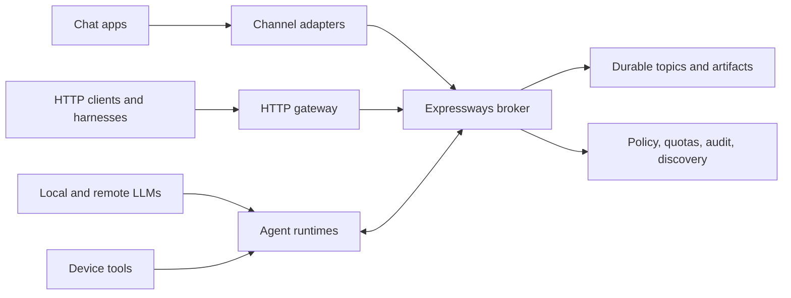

# Local Agent Backbone

## Product boundary

Expressways is the local control and data spine for agents running on a device. It connects agent runtimes, LLM providers, chat applications, automation harnesses, and local HTTP clients without making any one of those integrations the center of the system.

The broker remains authoritative for identity, authorization, quotas, durable messages, artifacts, discovery, audit, and service health. Edge components translate external protocols into that broker contract:

This is deliberately not a claim that Expressways is a general cloud queue, an LLM proxy, or an agent framework. It is the secure local substrate those components share.

## Backbone contracts

Every supported edge must preserve these contracts:

1. **Identity is end to end.** An adapter may authenticate an external caller, but every broker operation still uses a capability for a registered principal. Gateways must not introduce an unauthenticated trusted path.
2. **Work is durable and addressable.** Tasks have stable identifiers, retry policy, lifecycle events, and idempotency behavior. Conversation affinity serializes related work without globally serializing the broker.
3. **Data and large objects are separate.** Topics carry bounded coordination records. Large binary data is uploaded as a broker-managed artifact and referenced by identifier, length, media type, and SHA-256.
4. **Agents are discoverable and replaceable.** Agent cards declare skills and topic contracts. The orchestrator selects live eligible agents without embedding a particular harness into the broker.
5. **Replies are explicit.** Request/reply behavior uses versioned schemas, correlation identifiers, reply topics, and delivery identifiers rather than assuming an in-process call stack.
6. **Failure is visible.** Backpressure, retries, exhausted work, degraded subsystems, and failed delivery remain observable and auditable.
7. **Local operation is the baseline.** TCP is the cross-platform transport for macOS, Windows, and Linux. Unix sockets are an optional optimization, not a portability requirement.

## Implemented foundation

The repository currently provides:

- a cross-platform single-node broker with signed capabilities, server-side policy, quotas, audit, metrics, and degraded-mode behavior;
- append-only topics and managed artifacts with integrity metadata;
- agent registration, liveness, discovery watches, and an event-driven task orchestrator;
- task priority, retry, cancellation, hard agent selection, and per-conversation affinity ordering;
- a Rust client, CLI, worker helper, sample agents, and Ollama integration;
- an authenticated loopback HTTP gateway for health, topic I/O, task submission, discovery, and artifact transfer;
- a Nanobot-style runtime with OpenAI and Anthropic providers, tool execution, state, and streaming;
- a supported chat interoperability bridge with durable two-way delivery and binary artifact upload;
- local operator surfaces through the CLI, dashboard, and desktop console.

## Missing product surfaces

The full backbone vision is not complete until these surfaces are implemented and verified:

### HTTP gateway completion

The initial supported HTTP API exposes broker health, publish/consume, resumable topic SSE backed by bounded broker long polling, tasks, discovery, and artifact transfer for harnesses that cannot use the Rust wire client. It forwards caller capabilities to the broker so policy, quota, audit, and principal attribution remain authoritative, and refuses non-loopback binding. Completion still requires discovery mutations, an OpenAPI document, and conformance tests against a live broker deployment.

### Desktop lifecycle

Installable macOS, Windows, and Linux packages must own startup, shutdown, upgrades, local data paths, token provisioning, diagnostics, and recovery. The desktop console should operate the same broker rather than carrying a second source of truth.

### Adapter SDK and conformance suite

Channel and harness adapters need reusable request/reply types, idempotency helpers, artifact upload helpers, durable cursor storage, and contract tests. An integration should become supported only after it passes authentication, replay, ordering, large-object, backpressure, and recovery tests.

### End-to-end deployment profile

A single documented local profile must start the broker, orchestrator, one runtime, the HTTP gateway, and an example channel adapter; run a request through an LLM/tool-capable agent; deliver the correlated reply; restart components; and prove that acknowledged work is not lost or duplicated silently.

## Scale boundary

The intended unit is one device and one broker authority. Multiple agents and adapters may share that broker. Cross-device federation, clustering, and consensus are separate future decisions; they must not weaken the local security or recovery model merely to make the system sound distributed.
