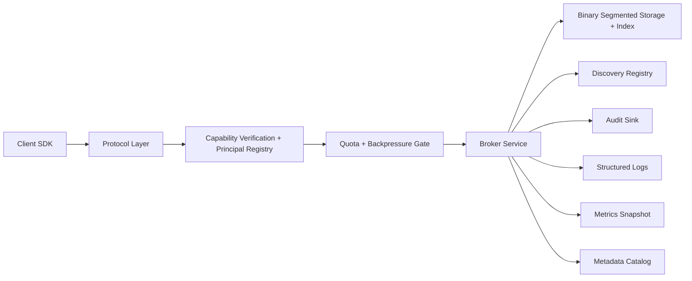

# Expressways Phase 1 System Design

## Overview

Phase 1 is a single-node, control-plane-first broker for local agent orchestration. It prioritizes correctness, auditability, and operational clarity over peak throughput. The system is intentionally small enough to run and evolve on a developer workstation, but it now uses a cross-platform local TCP baseline, signed capability tokens, a principal and issuer registry with revocation support, quota-aware request handling, runtime metrics, audit verification tooling, a file-backed discovery registry for exact-match agent lookup with TTL-based freshness control, and a binary indexed storage path with retention and recovery controls so the first release is not stuck in “prototype-only” mode.

## Goals

- Provide a durable local message broker with append-only storage.
- Support basic publish and consume operations.
- Enforce signed capability checks and server-side access control before any state-changing operation.
- Support explicit principal registration, issuer rotation, and revocation without bypassing the broker.
- Enforce per-principal quota and backpressure policy on size-sensitive and rate-sensitive paths.
- Surface enough runtime metrics for operators to explain request behavior, storage pressure, and audit volume.
- Enforce topic retention budgets and global disk-pressure limits before local workstation storage is exhausted.
- Emit structured logs and tamper-evident audit events for every external action.
- Carry compliance metadata with topics and messages.

## Non-Goals

- Multi-node clustering.
- Cross-host consensus.
- Shared-memory zero-copy transport.
- `io_uring` or kernel-specific fast paths.
- In-broker transforms.
- Semantic or vector-backed discovery registry.
- Priority reordering inside a strict ordered topic.

## Architecture

## Core Components

### Protocol Layer

Provides strongly typed control-plane requests and responses. Phase 1 uses a simple JSON protocol over local TCP by default, with Unix sockets available as an optional transport on Unix platforms. The protocol includes admin commands for auth-state inspection, revocation changes, metrics export, and discovery-registry operations including heartbeats, stale-entry cleanup, long-poll watch requests, and a dedicated multi-frame watch stream with cursor resume so operators can manage identity state and inspect runtime health without editing runtime files by hand.

### AuthN and AuthZ Gate

Verifies a signed capability token, checks audience and expiry, resolves the caller against the configured principal registry, applies issuer status and revocation state, and then maps the request to permitted actions against resources such as topics and administrative endpoints. The gate must run before publish, consume, or admin operations.

### Quota and Backpressure Gate

Applies the principal's configured quota profile before publish and consume work reaches storage. Phase 1 enforces payload-size limits, consume batch limits, and per-window request rates, with each profile declaring whether overload should reject immediately or delay until the current window resets.

### Broker Service

Coordinates request handling, topic resolution, storage operations, and audit emission. This layer owns the request lifecycle.

### Discovery Registry

Stores agent cards behind a backend seam that currently uses a local JSON file. Registry lookups support exact-match filters on skill, topic, and principal rather than semantic ranking. Ownership is derived from the authenticated principal, not caller-supplied metadata, so the registry does not become a side channel for identity spoofing. Cards also carry TTL-based liveness metadata so stale discovery entries do not linger in normal query results forever. A bounded in-memory event journal supports both long-poll watch subscriptions and a dedicated multi-frame watch stream for orchestrators that need change notifications, while explicit send timeouts and idle keepalive limits bound the server cost of stalled watchers.

### Event-Driven Orchestrator

Consumes the discovery-registry stream to maintain a local, event-driven view of eligible agents. The first orchestrator loop is intentionally small: it bootstraps from `list_agents`, tails the stream with cursor resume, and publishes audited assignment decisions back through the broker so orchestration starts using the same compliance and access-control path as every other action.

### Segmented Storage

Stores append-only records per topic in binary segment files with sidecar indexes for offset-based reads. Topics also carry default compliance tags and retention classes. The storage layer also enforces per-retention-class byte budgets, a global disk-pressure ceiling, and segment recovery that can rebuild indexes and truncate partial trailing frames after an unclean write.

### Audit Sink

Persists append-only audit events with hash chaining so tampering can be detected. Operators can also verify and export the audit chain offline.

### Metrics Snapshot

Collects broker counters, publish and consume latency summaries, storage maintenance statistics, audit log totals, and registry-stream lifecycle counters so operators can explain current behavior without reading raw files by hand.

### Metadata Catalog

Tracks topic definitions, retention classes, compliance defaults, discovery cards, and local operational metadata.

## Request Lifecycle

1. Client sends a control-plane request with a signed capability token.
2. Protocol layer decodes and validates the request.
3. Capability verification checks token signature, audience, expiry, scope, issuer status, and revocation state.
4. Server-side policy checks the verified principal against local policy.
5. Quota and backpressure checks run for publish and consume operations.
6. Broker service executes the action if allowed.
7. Registry ownership rules run for discovery-card mutations when applicable.
8. Structured operational log is emitted.
9. Audit event is appended with the decision and outcome.
10. Metrics are updated for the request path and any resulting storage or audit side effects.
11. Response is returned to the client.

## Data Model

### Topic

- `name`
- `retention_class`
- `default_classification`

### Message Record

- `message_id`
- `topic`
- `offset`
- `timestamp`
- `producer`
- `classification`
- `payload`

### Agent Card

- `agent_id`
- `principal`
- `display_name`
- `version`
- `summary`
- `skills`
- `subscriptions`
- `publications`
- `schemas`
- `endpoint`
- `classification`
- `retention_class`
- `ttl_seconds`
- `updated_at`
- `last_seen_at`
- `expires_at`

### Audit Event

- `event_id`
- `timestamp`
- `principal`
- `action`
- `resource`
- `decision`
- `outcome`
- `prev_hash`
- `hash`

### Broker Metrics Snapshot

- `uptime_seconds`
- `total_requests`
- `auth_failures`
- `policy_denials`
- `quota_denials`
- `storage_failures`
- `audit_failures`
- `publish`
- `consume`
- `storage`
- `audit`

### Capability Token

- `token_id`
- `principal`
- `audience`
- `issued_at`
- `expires_at`
- `scopes`

### Principal Record

- `id`
- `kind`
- `display_name`
- `status`
- `allowed_key_ids`
- `quota_profile`

## Operational Guarantees

- Denied actions are audited.
- Allowed actions are audited.
- Capability verification is mandatory.
- Policy evaluation is mandatory.
- Quota evaluation is mandatory for publish and consume paths.
- Discovery-card ownership is mandatory for registry mutation paths.
- Storage retention and disk-pressure checks are mandatory for append paths.
- All logs are structured and machine-readable.
- Audit logs are locally verifiable after the fact.
- Compliance classification is explicit, never implied by payload shape.

## Evolution Path

If Phase 1 proves useful, the next optimizations should come in this order:

1. richer storage indexing and batching,
2. benchmark-driven transport improvements,
3. Linux-specific fast path experiments,
4. richer discovery query semantics and orchestration features.
