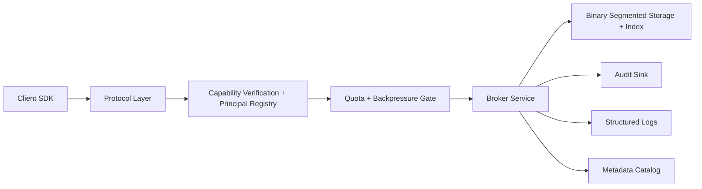

# Expressways Phase 1 System Design

## Overview

Phase 1 is a single-node, control-plane-first broker for local agent orchestration. It prioritizes correctness, auditability, and operational clarity over peak throughput. The system is intentionally small enough to run and evolve on a developer workstation, but it now uses a cross-platform local TCP baseline, signed capability tokens, a principal and issuer registry with revocation support, quota-aware request handling, and a binary indexed storage path so the first release is not stuck in “prototype-only” mode.

## Goals

- Provide a durable local message broker with append-only storage.
- Support basic publish and consume operations.
- Enforce signed capability checks and server-side access control before any state-changing operation.
- Support explicit principal registration, issuer rotation, and revocation without bypassing the broker.
- Enforce per-principal quota and backpressure policy on size-sensitive and rate-sensitive paths.
- Emit structured logs and tamper-evident audit events for every external action.
- Carry compliance metadata with topics and messages.

## Non-Goals

- Multi-node clustering.
- Cross-host consensus.
- Shared-memory zero-copy transport.
- `io_uring` or kernel-specific fast paths.
- In-broker transforms.
- Semantic discovery registry.
- Priority reordering inside a strict ordered topic.

## Architecture

## Core Components

### Protocol Layer

Provides strongly typed control-plane requests and responses. Phase 1 uses a simple JSON protocol over local TCP by default, with Unix sockets available as an optional transport on Unix platforms. The protocol includes admin commands for auth-state inspection and revocation changes so operators can manage identity state without editing runtime files by hand.

### AuthN and AuthZ Gate

Verifies a signed capability token, checks audience and expiry, resolves the caller against the configured principal registry, applies issuer status and revocation state, and then maps the request to permitted actions against resources such as topics and administrative endpoints. The gate must run before publish, consume, or admin operations.

### Quota and Backpressure Gate

Applies the principal's configured quota profile before publish and consume work reaches storage. Phase 1 enforces payload-size limits, consume batch limits, and per-window request rates, with each profile declaring whether overload should reject immediately or delay until the current window resets.

### Broker Service

Coordinates request handling, topic resolution, storage operations, and audit emission. This layer owns the request lifecycle.

### Segmented Storage

Stores append-only records per topic in binary segment files with sidecar indexes for offset-based reads. Topics also carry default compliance tags and retention classes.

### Audit Sink

Persists append-only audit events with hash chaining so tampering can be detected.

### Metadata Catalog

Tracks topic definitions, retention classes, compliance defaults, and local operational metadata.

## Request Lifecycle

1. Client sends a control-plane request with a signed capability token.
2. Protocol layer decodes and validates the request.
3. Capability verification checks token signature, audience, expiry, scope, issuer status, and revocation state.
4. Server-side policy checks the verified principal against local policy.
5. Quota and backpressure checks run for publish and consume operations.
6. Broker service executes the action if allowed.
7. Structured operational log is emitted.
8. Audit event is appended with the decision and outcome.
9. Response is returned to the client.

## Data Model

### Topic

- `name`
- `retention_class`
- `default_classification`

### Message Record

- `message_id`
- `topic`
- `offset`
- `timestamp`
- `producer`
- `classification`
- `payload`

### Audit Event

- `event_id`
- `timestamp`
- `principal`
- `action`
- `resource`
- `decision`
- `outcome`
- `prev_hash`
- `hash`

### Capability Token

- `token_id`
- `principal`
- `audience`
- `issued_at`
- `expires_at`
- `scopes`

### Principal Record

- `id`
- `kind`
- `display_name`
- `status`
- `allowed_key_ids`
- `quota_profile`

## Operational Guarantees

- Denied actions are audited.
- Allowed actions are audited.
- Capability verification is mandatory.
- Policy evaluation is mandatory.
- Quota evaluation is mandatory for publish and consume paths.
- All logs are structured and machine-readable.
- Compliance classification is explicit, never implied by payload shape.

## Evolution Path

If Phase 1 proves useful, the next optimizations should come in this order:

1. richer storage indexing and batching,
2. benchmark-driven transport improvements,
3. Linux-specific fast path experiments,
4. optional discovery and richer orchestration features.
